Das Modul "Feeds importieren" ermöglicht, alle Daten für beliebige Entität im AtroCore-System zu importieren, verwandte Entitäten zu verknüpfen oder zu erstellen, z. B. ist es möglich, die Produktdaten zusammen mit den entsprechenden Kategorien, Marken usw. zu importieren. Sie können viele Import-Feeds erstellen, konfigurieren und verwenden.

Mit Hilfe des Moduls "Feeds importieren" kann der Datenimport auf zwei Arten erfolgen:

- **manuell** – durch direkte Verwendung eines konfigurierten Import-Feeds
- **automatisch** – nach geplantem Job.

Sie können nur dann einen geplanten Job für Ihre Importaufgaben erstellen, wenn ein entsprechender Importfeedtyp in Ihrem System verfügbar ist. Solche Import-Feed-Typen ermöglichen, die Daten per URL herunterzuladen, einen REST-API-Aufruf auszuführen, eine Abfrage direkt aus der Datenbank auszuführen (dafür werden Premium-Module benötigt). Mit diesem kostenlosen Modul können Sie die Daten manuell aus CSV-Dateien importieren. Sie können auch Ihre eigenen Import-Feed-Typen programmieren lassen.

## Die folgenden Module erweitern die Funktionalität der Import-Feeds

- Import Feeds: Rollback – ermöglicht das Rollback des letzten Imports mit der vollständigen Datenwiederherstellung
- Import Feeds: Datenbanken – ermöglicht den Import von Daten aus MSSQL-, MySQL-, PostgreSQL-, Oracle-, HANA-Datenbanken
- Import Feeds: JSON und XML – ermöglicht den Import von Daten aus JSON- und XML-Dateien
- Import Feeds: URL – ermöglicht den Import von Daten per URL aus CSV-, JSON- und XML-Dateien
- Import Feeds: REST API – ermöglicht den Datenimport über die REST API
- Connector – orchestriert mehrere Import- und Export-Feeds, um einen komplexen Datenaustausch zu automatisieren

## Funktionen für den Administrator
Nach der Modulinstallation werden in Ihrem System zwei neue Entitäten erstellt - `Import Feeds` und `Import-Ergenisse`. Über `Administration > System > User Interface` können Sie diese Elemente zur Navigation Ihres Systems hinzufügen, falls es nicht automatisch geschehen ist.
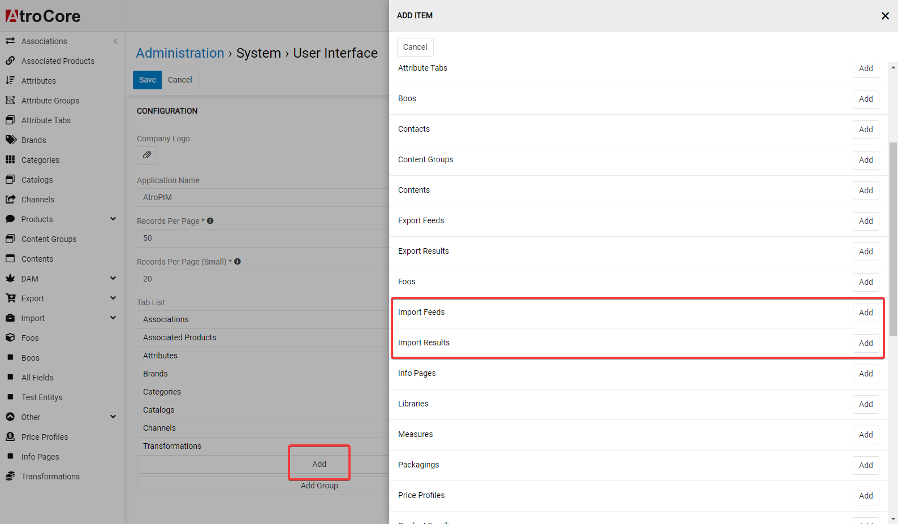

### Zugangsrechte
Um die Erstellung, Bearbeitung, Nutzung und Entfernung des Import Feeds für andere Nutzer zu ermöglichen, konfigurieren Sie die entsprechenden Zugangsrechte zu den Entitäten `Import Feeds` und `Import-Ergebnisse` für die gewünschte Benutzer-/Team-/Portalbenutzerrolle auf der Seite `Administration > Rollen > 'Rollenname'`:
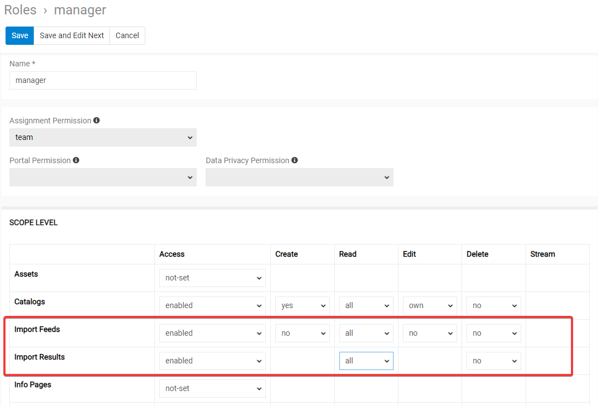
Bitte beachten Sie, dass für einen Nutzer mindestens die Gewährung des Leserechts auf `Import-Feeds` erforderlich ist, damit er die Import Feeds auszuführen kann.   

## Funktionen für den Nutzer
Nachdem das Modul „Import Feeds“ vom Administrator installiert und konfiguriert wurde, kann der Nutzer mit Import Feeds entsprechend seiner Rollenrechte arbeiten, die vom Administrator vordefiniert wurden.

## Erstellung von Import Feeds
Um einen neuen Import Feed zu erstellen, klicken Sie im Navigationsmenü auf `Import Feeds` und dann auf den Button `Import Feed erstellen`. 

> Wenn es im Navigationsmenü keine `Import-Feeds`-Option gibt, wenden Sie sich bitte an Ihren Administrator.

Das Standardformular für die Importfeederstellung erscheint:
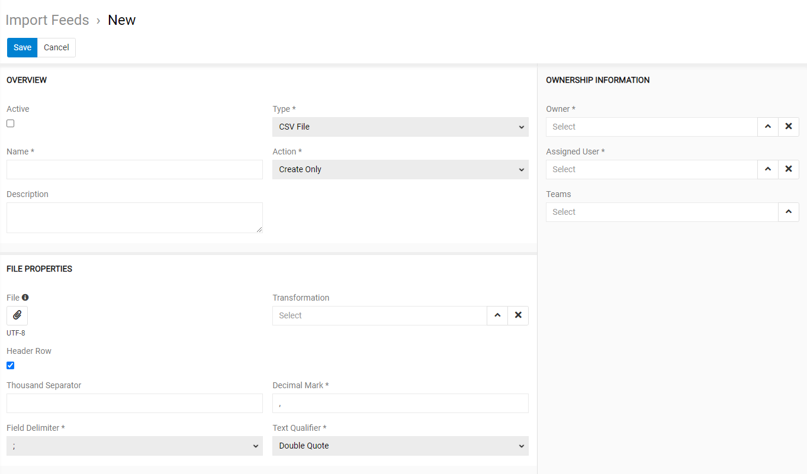

Füllen Sie hier die Pflichtfelder aus und wählen den Import-Feed-Typ aus der entsprechenden Drop-down-Liste aus. Dieses Modul fügt den Import-Feed-Typ **CSV Datei** hinzu. 
Klicken Sie auf den Button `Speichern`. Der neue Datensatz wird zu der Import-Feeds-Liste hinzugefügt. Sie können es sofort auf Detailansichtsseite konfigurieren oder es später machen.

### Übersicht

Im Abschnitt Übersicht können Sie die wichtigsten Feedparameter (Name, Aktion, Aktivität usw.) definieren:
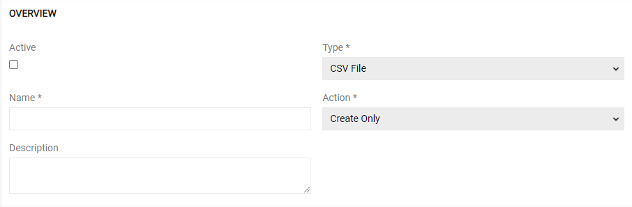

Folgende Einstellungen stehen hier zur Verfügung:

- **Aktiv** – Aktivität des Import-Feeds, Import ist nicht möglich, wenn dieses Kontrollkästchen nicht aktiviert ist
- **Name** – Importfeedname
- **Beschreibung** – Beschreibung des Import-Feeds, kann als Erinnerung für die Zukunft oder als Hinweis für andere Benutzer des angegebenen Import-Feeds verwendet werden
- **Typ** – der Import-Feed-Typ, kann später nicht geändert werden
- **Aktion** – Definieren Sie die Aktion, die beim Datenimport im System ausgeführt werden soll:
     - *Nur erstellen* – es werden nur neue Datensätze angelegt, bestehende Datensätze werden nicht aktualisiert
     - *Nur Update* – bestehende Datensätze werden aktualisiert, neue Datensätze werden nicht erstellt
     - *Create & Update* – neue Datensätze werden erstellt und die bestehenden Datensätze werden aktualisiert.

### Dateieigenschaften 

Die Parameter der Importdatei werden im Panel `FILE PROPERTIES` konfiguriert:

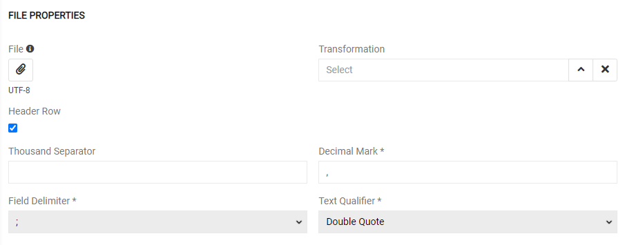

- **Datei** – hier können Sie die zu importierende Datei oder deren gekürzte Version hochladen, die für die Konfiguration verwendet wird. Die Datei sollte UTF-8-kodiert sein.
- **Kopfzeile** – Aktivieren Sie die Checkbox, wenn die Importdatei Spaltennamen hat oder lassen Sie diese leer, wenn die zu importierende Datei keine Kopfzeile mit Spaltennamen hat.
- **Tausender-Trennzeichen** – Definieren Sie das Symbol, das als Tausender-Trennzeichen verwendet wird. Dieser Parameter ist optional. Es werden auch die Zahlenwerte ohne Tausendertrennzeichen importiert (zB beide Werte 1234,34 und 1.234,34 werden importiert, wenn "." als Tausendertrennzeichen definiert ist).
- **Dezimalzeichen** – Wählen Sie das verwendete Dezimalzeichen aus, normalerweise sollte hier `.` oder `,` gesetzt werden.
- **Feldtrennzeichen** – Wählen Sie das bevorzugte Feldtrennzeichen, das in der CSV-Importdatei verwendet werden soll, mögliche Werte sind `,`, `;`,`\t`, `|`.
- **Textqualifizierer** – Wählen Sie das Trennzeichen der Werte innerhalb einer Zelle: Es können einfache oder doppelte Anführungszeichen ausgewählt werden.

### Einstellungen
Das nächste Panel ist das Einstellungspanel:

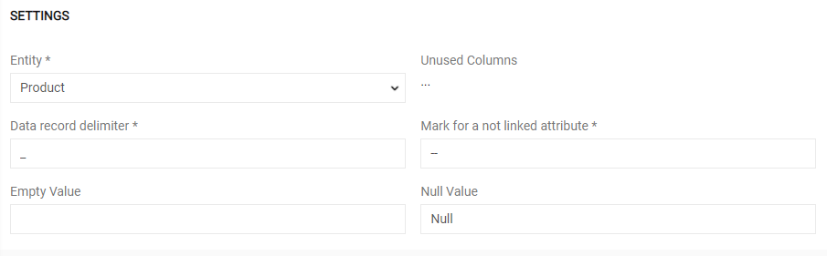

- **Entität** – wählen Sie die gewünschte Entität für die zu importierenden Daten aus der Dropdown-Liste aller im System verfügbaren Entitäten aus.
- **Unbenutzte Spalten** – dieses Feld ist zunächst leer. Nach dem Speichern sehen Sie hier die Liste der verfügbaren nicht zugeordneten Spalten.
- **Feldtrennzeichen für Relation** – Feldtrennzeichen, das verwendet wird, um Felder in der Relation zu trennen, Standardwert ist "|".
- **Datensatz-Trennzeichen** – ist das Trennzeichen zum Aufteilen mehrerer Werte (zB für Multienum- oder Array-Felder und -Attribute) oder mehrerer zusammengehöriger Datensätze.
- **Markierung für ein nicht verknüpftes Attribut** – diese Markierung ist nur für die Produktentität verfügbar. Dieses Symbol kennzeichnet Attribute, die nicht mit dem jeweiligen Produkt verknüpft werden sollen.
- **Leerer Wert** – Dieses Symbol wird zusätzlich zur leeren Zelle als "leerer" Wert interpretiert, zB "" und "kein" wird als "" interpretiert, wenn Sie "kein" als leeren Wert definieren.
- **Nullwert** – dieser Wert wird als "NULL"-Wert interpretiert.

Wenn Sie Produktdaten importieren, können einige Produkte bestimmte Attribute haben, andere nicht. Wenn der Wert für ein Attribut leer ist, ist nicht klar, ob dieses Attribut einen leeren Wert hat oder ob dieses Produkt dieses Attribut gar nicht hat. Aus diesem Grund sollte die **Markierung für ein nicht verlinktes Attribut** verwendet werden, um eindeutig zu kennzeichnen, welches Attribut nicht mit einem bestimmten Produkt verknüpft werden soll.

Wenn das Feld `Unbenutzte Spalten` nach dem Speichern Ihres Feeds leer ist, sollten Sie Ihr Feldtrennzeichen auf Richtigkeit überprüfen. Wenn einige Spaltennamen einfache oder doppelte Anführungszeichen enthalten, haben Sie möglicherweise den falschen Textqualifizierer eingestellt.

> Bitte beachten Sie, dass die definierten Symbole `Feldbegrenzer`, `Datensatzbegrenzer`, `Nullwert`, `Nullwert`, `Tausender-Trennzeichen`, `Dezimalzeichen`, `Textqualifizierer`  und `Markierung für ein nicht verknüpftes Attribut` unterschiedlich sein müssen.

### Konfigurator

Der Konfigurator kann verwendet werden, nachdem der Import-Feed erstellt wurde. Anfänglich ist dieses Panel leer. Hier werden Zuordnungsregeln für Ihren Datenimport angezeigt.

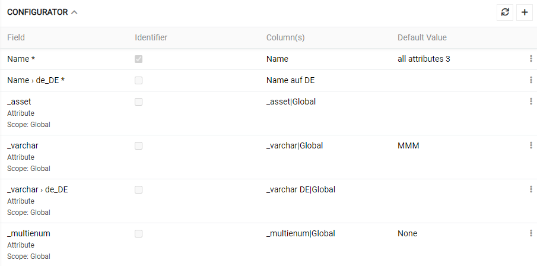

Um einen neuen Eintrag zu erstellen, klicken Sie auf das `+`-Symbol in der oberen rechten Ecke. Ein Popup-Fenster wird angezeigt.

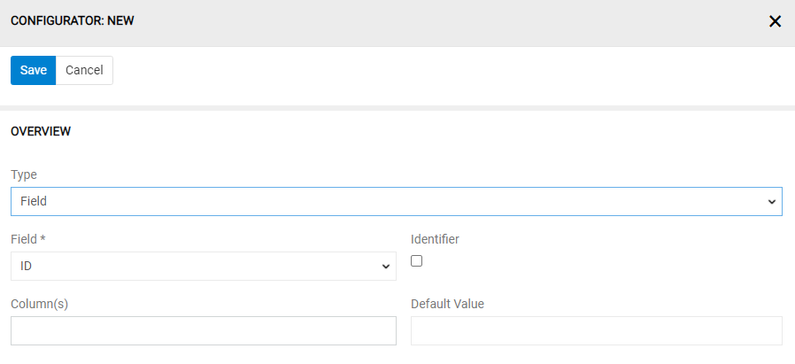

- **Typ** – wählen Sie den Typ Ihrer Mapping-Regel aus, indem Sie im Feld "Typ" "Feld" von "Attribut" auswählen. Die Option "Attribut" ist nur für die Produktentität verfügbar.

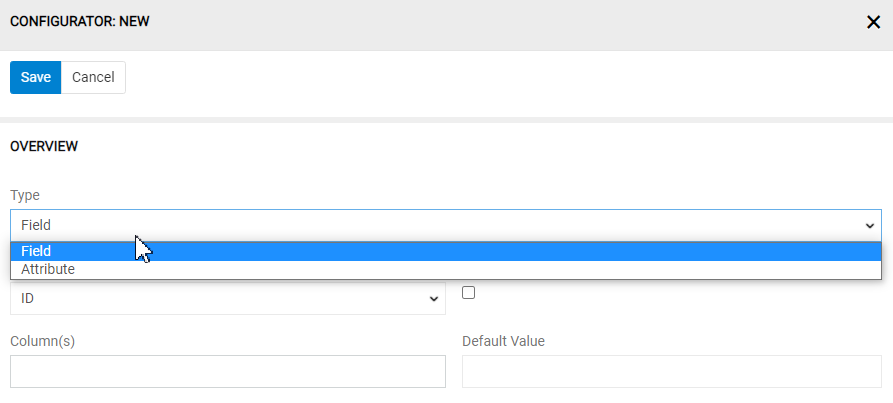

- **Feld** – Wählen Sie das Feld für Ihre ausgewählte Entität aus, in das die Daten aus der/den ausgewählten Spalte(n) zu importieren sind.
- **Kennung** – setzen Sie die Checkbox, wenn der Wert in der ausgewählten Spalte als Identifier interpretiert werden soll. Sie können mehrere Spalten als Kennung auswählen.
- **Spalte(n)** – je nach Typ des ausgewählten Entitätsfeldes können Sie hier eine, zwei oder mehrere Spalten auswählen.
- **Standardwert** – Sie können den zu setzenden Standardwert angeben, wenn der Zellenwert "", "leer" oder "null" ist.

Klicken Sie auf den Button "Speichern", um die Zuordnungsregel abzuspeichern.

> Bitte beachten Sie, dass eine bestimmte Spalte in verschiedenen Regeln mehrfach verwendet werden kann.

Um die im 'Konfigurator' angezeigte Zuordnungsregel zu ändern, verwenden Sie die Option 'Bearbeiten' aus dem Aktionsmenü für einzelne Mapping-Datensätze. Hier können Sie auch die ausgewählte Regel löschen.

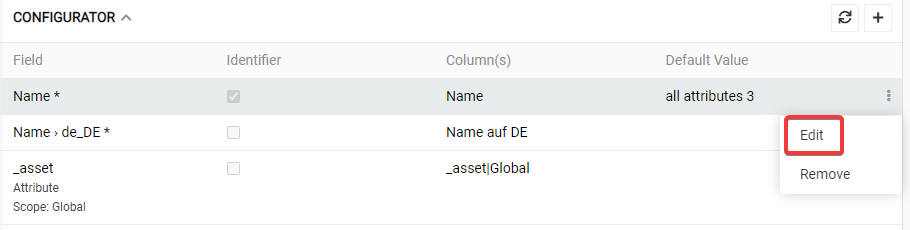

### Kennung (Identifier)
Für jedes Feld können Sie festlegen, ob dieses als Kennung (Identifier) gilt oder nicht. Alle Kennungen werden gemeinsam bei der Suche nach einem Datensatz in der Datenbank verwendet. Wenn Sie zB "Name" und "Marke" als Kennung beim Import in die Produktentität auswählen, versucht das System, ein solches Produkt anhand der Zellenwerte für diese beiden Felder zu finden. Wenn ein Datensatz gefunden wird, wird dieser mit den Werten aus der Importdatei aktualisiert. Wenn mehr als ein Datensatz gefunden wird, erhalten Sie eine Fehlermeldung und der Import wird nicht ausgeführt.

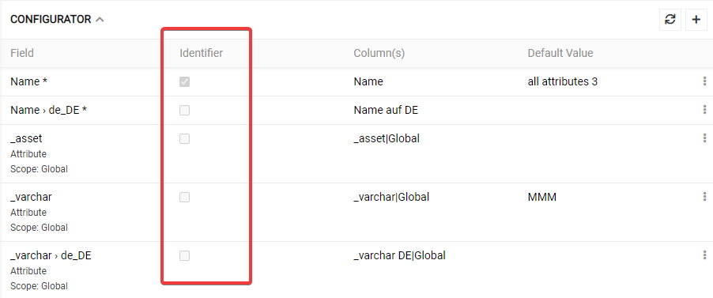

### Standardwert
Für jede Zuordnungsregel sollten die Spalte(n) oder der Standardwert oder beide ausgefüllt werden. Somit ist es möglich, den Standardwert festzulegen, ohne die Spalte(n) auszuwählen. In diesem Fall wird dieser Wert auf alle Datensätze angewendet. Sie können beispielsweise einen Wert für den "Katalog" festlegen. Wenn Sie Produktdaten importieren würden, werden alle Produkte automatisch dem ausgewählten Katalog zugeordnet, auch wenn Ihre Importdatei keine Spalte für "Katalog" enthält. Wird "Standardwert" leer gelassen oder kein Wert gesetzt, wird kein Standardwert als Wert übernommen.

### Attribute
Nur die Produktentität kann Attribute haben. Alle Produkte haben die gleichen Felder, können aber unterschiedliche Attribute haben (Attribut kann also als ein dynamisches Feld angesehen werden). Nur Attribute können kanalspezifische Werte haben. Um eine Zuordnungsregel für ein Attribut zu erstellen, sollen Sie beim "Typ" "Attribut" als Wert auswählen. Setzen Sie den Scope (Geltungsbereich) auf "Global", wenn der zu importierende Wert als globaler Attributwert festgelegt werden soll. Wenn dieser Wert für das Attribut als kanalspezifischer Wert gesetzt werden sollte, setzen Sie den "Scope" auf "Channel" und wählen Sie im nächsten Feld den entsprechenden Kanal aus.

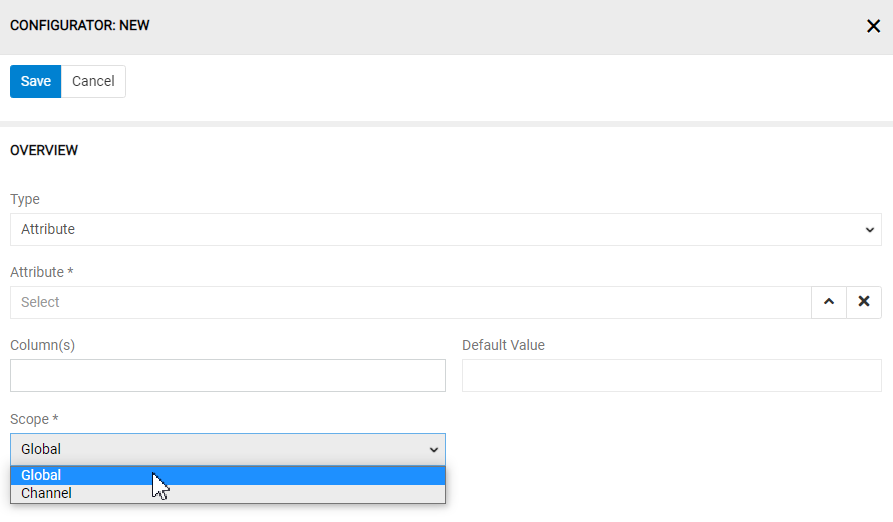

### Attribute als nicht verknüpft markieren
Sie können Produktdaten für Produktfelder und Produktattribute gleichzeitig importieren. In diesem Fall sind Produktfelder und Produktattribute Spalten in Ihrer zu importierenden Datei. Wenn Sie für ein Attribut den Wert "", "leer" oder "null" verwenden, ist es unmöglich festzustellen, ob dieses Produkt dieses Attribut ohne Wert hat oder gar nicht nicht hat. Mit der `Markierung für ein nicht verlinktes Attribut` können Sie explizit die Attribute markieren, die mit einem bestimmten Produkt nicht verknüpft werden sollen. Standardmäßig wird "--" verwendet. Lassen wir uns ein Beispiel ansehen.

In diesem Beispiel werden dem Produkt "alle Attribute 4" die Attribute "\_asset", "\_varchar" und "\_varchar DE" gar nicht verknüpft.

### Boolesche Felder und Attribute
Durch den Import von booleschen Feldern oder Attributen werden "0" und "False" unabhängig von Groß- und Kleinschreibung als FALSE-Wert interpretiert. "1" und "True" werden als WAHR-Wert interpretiert. Wenn NULL-Wert für boolesches Feld oder Attribut nicht zulässig ist, werden "" und "leerer" Wert auch als FALSE-Wert interpretiert.

### Multienum-Felder und -Attribute
Sie können Multienum-Werte für Felder und Attribute importieren, indem Sie ihre Werte mit Hilfe von `Datensatz-Trennzeichen` trennen. In unserem Beispiel verwenden wir dafür das Symbol ",".

.

Es können nur vordefinierte Werte akzeptiert werden, wenn Ihr Multienum-Feld oder -Attribut vordefinierte Optionen hat. Wenn einer der in der zu importierenden Datei angegebenen Multienum-Werte nicht gültig ist, wird die gesamte Zeile nicht importiert. Wenn Ihr Multienum-Feld oder -Attribut keine vordefinierten Optionen hat, wird jeder Wert akzeptiert.

### Feld- und Attributtypen für Währung und Einheit
Felder und Attribute von Währungs- und Einheittypen haben Werte, die aus zwei Teilen bestehen – der erste ist vom Typ Float und der zweite vom Typ Enum, diese sind durch ein Leerzeichen getrennt. Beispiele für gültige Werte sind also "9 cm", "110,50 EUR", "100.000 USD", "3000 EUR" usw.

Daten für Währungs- und Einheitfelder und Attribute können in einer oder in zwei Spalten bereitgestellt werden. Wenn Sie im Feld "Spalte(n)" zwei Spalten angeben, wird in der ersten Spalte immer der Zahlenwert und in der zweiten Spalte der Währungs- oder Einheitsname erwartet.

Wenn nur eine Spalte angegeben wird, wird erwartet, dass sich der gesamte Währungs- oder Einheitswert in dieser einzelnen Spalte befindet.

Auch der Standardwert besteht aus zwei Teilen. Es ist möglich, standardmäßig nur den Währungs- oder Einheitsnamen zu speichern, ohne einen numerischen Wert zu speichern. In diesem Fall wird dieser Wert angewendet, wenn in den im Feld "Spalte(n)" eingestellten Spalten kein Währungs- oder Einheitsname gefunden wird. Wenn also zum Beispiel nur "123" angegeben wird und "EUR" als Standardwährung eingestellt ist, wird "123 EUR" als Wert abgespeichert.

### Beziehungen
Jede Entität kann Eins-zu-Viele-, Viele-zu-Eins- oder Viele-zu-Viele-Beziehungen zu anderen Entitäten haben. Das Modul Import Feeds ermöglicht den Import von Daten mit direkten Beziehungen aller Art durchzuführen. Ein Datensatz der zugehörigen Entität kann gefunden und verknüpft werden oder ein neuer Datensatz für die zugehörige Entität wird erstellt und verknüpft. Jede Relation steht zur Konfiguration als Feld zur Verfügung. Um eine Zuordnungsregel für eine Relation zu erstellen, müssen Sie den "Typ" Ihrer Zuordnungsregel auf "Feld" setzen und Ihren Relationsnamen im "Feld" Feld wählen. Lassen Sie uns "Marke" als Beziehung konfigurieren. Wir wählen also "Marke" im Feld "Feld" und "Marke" im Feld "Spalte(n)". Für eine Relation müssen wir auch die zugehörigen Entitätsfelder auswählen – wir wählen ID, Name, Name auf Deutsch, Aktiv und Code.

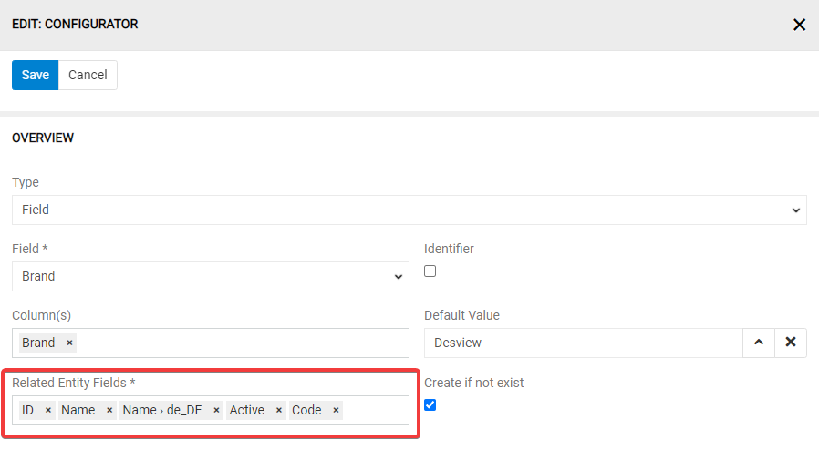

Wir möchten, dass die Marke erstellt wird, wenn sie in unserem System nicht gefunden wird. Deshalb setzen wir die Checkbox für die Option „Erstellen, falls nicht vorhanden“.

Die Zelle "Marke" in Ihrer CSV-Datei sollte wie folgt aussehen:

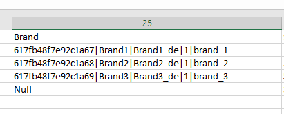

Alle Feldwerte sollten durch das "Feldtrennzeichen für Relation" getrennt werden. Standardmäßig ist Pipeline-Symbol "|" als Feldtrennzeichen für Relation eingestellt. 

Wenn "Brand1" existiert, wird es gefunden und verlinkt. Wenn "Brand2" nicht existiert, wird es erstellt und mit dem entsprechenden Produktdatensatz verknüpft.

> ID ist hier nicht erforderlich. Sie können nur "ID" verwenden, wenn alle Marken in Ihrem System bereits vorhanden sind. Sie können nur "Name", "Name auf Deutsch", "Aktiv" und "Code" auswählen, wenn die Marken in Ihrem System nicht vorhanden sind und durch den Import erstellt werden sollen. In diesem Fall wird die "ID" automatisch erstellt. Bitte beachten Sie, dass Datensätze für Marken nur dann erstellt werden, wenn "Name", "Name auf Deutsch", "Aktiv" und "Code" die einzigen Pflichtfelder für die Markenentität sind.

Das System verwendet alle zugehörigen Entitätsfelder, um nach der Beziehung zu suchen. Wird keine Relation gefunden und ist die Checkbox „Erstellen falls nicht vorhanden“ nicht gesetzt, wird die Relation ignoriert – keine Relation wird erstellt.

Die Anzahl der konfigurierten zugehörigen Entitätsfelder sollte kleiner oder gleich der Anzahl der Werte für die Beziehung in der Zelle sein. Wenn Sie beispielsweise nur "ID" und "Name" als zugehörige Entitätsfelder auswählen, werden die Daten trotzdem importiert und nur diese beiden Werte werden verwendet, um nach einer Kategorie zu suchen.

Kann der neue Datensatz für die Relation nicht angelegt werden, generiert das System einen Fehler und das System importiert nichts aus der entsprechenden Zeile.

### Mehrere Beziehungen
Mehrere Beziehungen funktionieren wie einfache Beziehungen. Der einzige Unterschied besteht darin, dass Sie mehrere Beziehungen gleichzeitig erstellen können. Mehrere Datensätze für eine zugehörige Entität sollten durch `Datensatz-Trennzeichen` getrennt werden. Zum Beispiel Produkte sind über eine Viele-zu-Viele-Beziehung mit Kategorien verknüpft, was bedeutet, dass ein Produkt verschiedenen Kategorien zugeordnet werden kann und eine Kategorien viele zugeordnete Produkte haben kann. Beispielsweise können wir Produktdaten zusammen mit Kategorien wie folgt importieren:

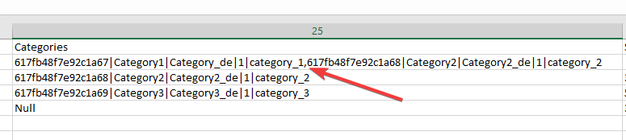

In diesem Beispiel wird das Produkt aus der ersten Datenzeile mit "Kategorie1" und "Kategorie2" verknüpft, hier wird das ","-Symbol als `Datensatz-Trennzeichen` verwendet.
Das zweite und das dritte Produkt werden mit "Kategorie2" bzw. "Kategorie3" verknüpft. Der Datensatz für "Kategorie2" wird nur einmal beim Anlegen/Aktualisieren des ersten Produkts erstellt (falls es im System nicht vorhanden ist) und mit dem ersten und dem zweiten Produkt verknüpft.

Wenn eine der mehreren Relationen nicht gefunden und der Datensatz nicht erstellt werden kann (vorausgesetzt, die Checkbox `Erstellen, wenn nicht vorhanden` ist gesetzt), wird die ganze Zeile nicht importiert. Wenn die Option `Erstellen, wenn nicht existiert` nicht gesetzt ist, werden alle nicht gefundenen Beziehungen ignoriert.

## Import-Feed-Ausführung  
Um den Import der Daten über den aktiven Import Feed zu starten, wählen Sie die Option `Import durchführen` im Menü "Aktionen" auf der Detail-Ansichtsseite des Import Feeds oder im Menü für einzelne Datensatzaktionen auf der Seite der Listenansicht von "Import Feeds":

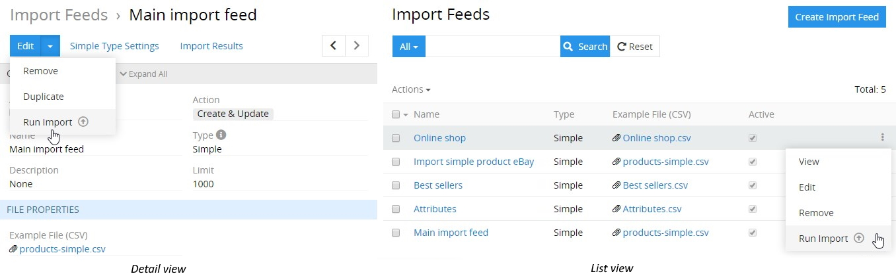

Hängen Sie im angezeigten Pop-up die CSV-Datei mit den zu importierenden Daten an und klicken Sie auf den Button `Import durchführen`, um den Vorgang zu starten:

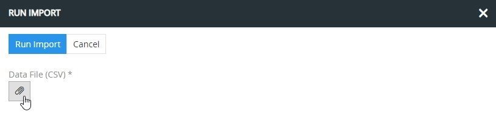

Achten Sie bitte darauf, dass die zu importierende Datei mit der Beispieldatei übereinstimmen muss, die für den bestimmten Import Feed definiert ist. Andernfalls wird die folgende Fehlermeldung angezeigt:

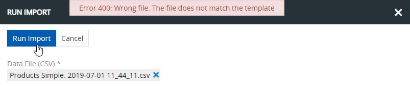 

Wenn der Import gestartet ist, werden seine Details und aktueller Status im Pop-up des Queue Managers angezeigt, das automatisch erscheint:

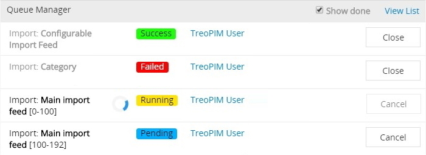

Bitte beachten Sie, dass wenn die Anzahl der Datensätze in der zu importierenden Datei den [Grenzwert](#konfiguration-von-import-feeds) überschreitet, der im Panel `ÜBERBLICK` des entsprechenden Import Feeds definiert ist, der Import Job gemäß dem Grenzwert in entsprechende Teile aufgeteilt wird.

### Importergebnisse
Informationen über abgeschlossene Import Jobs werden im Panel `IMPORT RESULTS` angezeigt. Dieses Panel ist  während des Vorgangs der [Erstellung](#erstellung-von-import-feeds) eines Import Feeds zunächst leer, wird jedoch ausgefüllt, nachdem der Datenimport über den bestimmten Import Feed durchgeführt wurde.

Die Ergebnisse der Daten-Importvorgänge können auf zwei Arten angezeigt werden:

- im **Panel `IMPORT RESULTS` ** des Import Feeds - die Details zu den Importvorgängen, die über den aktuell geöffneten Import Feed durchgeführt werden: 

  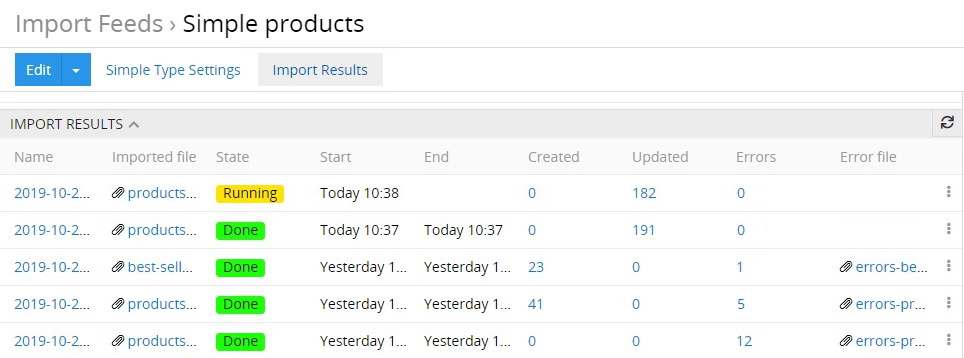

- auf der **Seite der Listenansicht von Importergebnissen** - Details zu allen Importvorgängen, die im System über Import Feeds durchgeführt werden:

  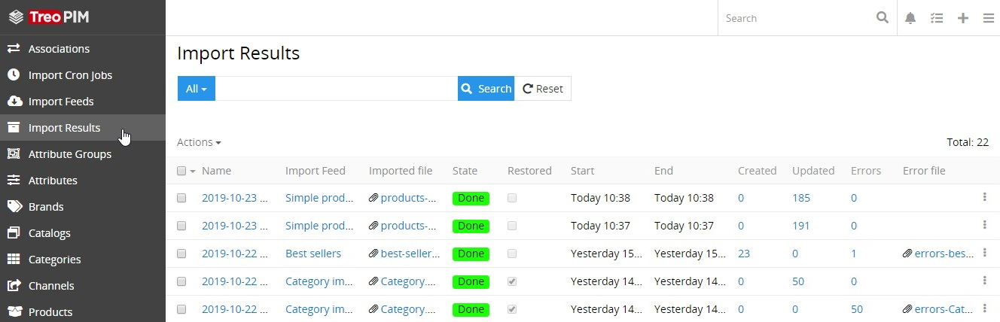

Die Details der Importergebnisse enthalten folgende Informationen: 

- **Name** – der Name des Datensatzes mit den Importergebnissen, der basierend auf dem Datum und der Zeit des Starts des Importvorgangs automatisch generiert wird. Klicken Sie auf den Namen des Datensatzes mit den Importergebnissen, um dessen Detail-Ansichtsseite zu öffnen.
- **Import Feed** – der Name des Import Feeds, der für den Importvorgang verwendet wird.
- **Importierte Datei** – der Name der Datei (CSV), die für den Importvorgang verwendet wird. 
- **Status** – der aktuelle Status des Importvorgangs. 
- **Wiederhergestellt** – die Angabe, ob der bestimmte Datensatz mit dem Importergebniss wiederhergestellt wurde (die Checkbox ist gesetzt) oder nicht. Verfügbar nur auf der Seite der Listenansicht  der Importergebnisse. 
- **Start** – das Datum und die Zeit des Starts des Importvorgangs. 
- **Ende** – das Datum und die Zeit der Beendigung des Importvorgangs.
- **Erstellt** – die Anzahl der Datensätze, die als Ergebnis des durchgeführten Importvorgangs erstellt wurden. Klicken Sie auf diesen Wert für das gewünschte Importergebnis, um die Seite mit der Listenansicht der entsprechenden Entitätsdatensätze zu öffnen, welche nach dem angegebenen Importergebnis gefiltert sind, d.h. mit dem angewendeten Filter `Erstellt durch Import`. 
- **Aktualisiert** – die Anzahl der Datensätze, die als Ergebnis des durchgeführten Importvorgangs aktualisiert wurden. Klicken Sie auf diesen Wert für das gewünschte Importergebnis, um die Seite mit der Listenansicht der entsprechenden Entitätsdatensätze zu öffnen, welche nach dem angegebenen Importergebnis gefiltert sind, d.h. mit dem angewendeten Filter `Aktualisiert durch Import`.
- **Fehler** - die Anzahl der Fehler, soweit vorhanden, die während des Importvorgangs aufgetreten sind. 
- **[Fehlerdatei](#fehlerdatei)** – der Name der CSV-Datei, die nur Zeilen mit Fehlern enthält. Die Fehlerdatei wird auf Grund des Namens der importierten Datei automatisch generiert. 

Folgende Statusmeldungen können auftreten: 

- **Running** – für den aktuell laufenden Import Job. 

- **Pending** –  für den Import Job, der als nächster ausgeführt werden soll. 
- **Success** – für den erfolgreich abgeschlossenen Import Job (unabhängig davon, ob er Fehler enthält). 
- **Failed** – für den Import Job, der wegen einiger technischer Probleme nicht ausgeführt werden konnte. 

#### Details

Um die Details des Datensatzes mit den Importergebnissen anzusehen, klicken Sie auf dessen Namen im Panel `IMPORT RESULTS` auf der Detail-Ansichtsseite des gewünschten Import Feeds oder in der Liste der Importergebnisse. Es wird die Detail-Ansichtsseite des entsprechenden Datensatzes angezeigt:

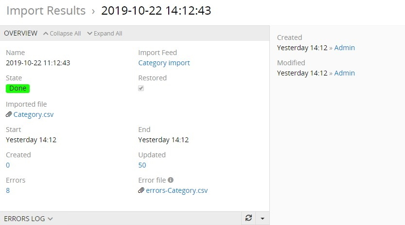

Die Fehlermeldungen, falls solche vorhanden sind, werden im Panel `ERRORS LOG` auf dieser Seite angezeigt:  

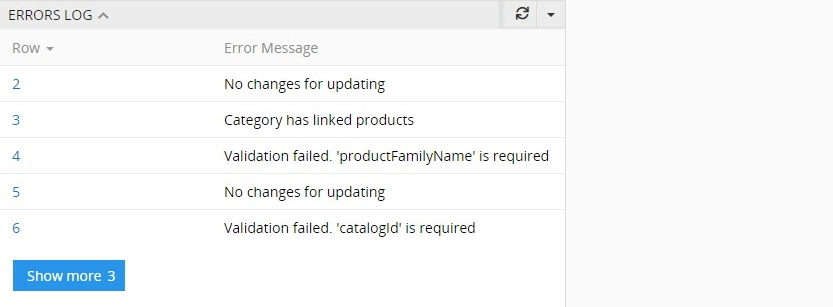

Um die vollständige Liste der Fehlerdatensätze anzuschauen, nutzen Sie den Befehl `Vollständige Liste anzeigen` im Aktionsmenü. Die Liste der Logs der Importergebnisse wird mit Datensätzen angezeigt, die nach dem angegebenen Importergebnis gefiltert sind:

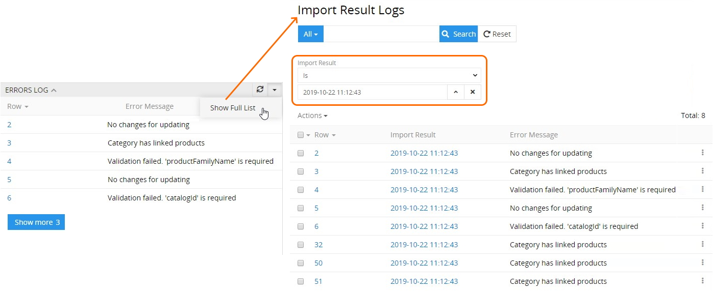

Alternativ können Sie die Details des Datensatzes mit den Importergebnissen in dem Pop-up ansehen, welches angezeigt wird, wenn Sie die Option `Ansehen` aus dem Menü für einzelne Datensatzaktionen für den gewünschten Datensatz auf der Seite der Listenansicht  von Importergebnissen nutzen. Das Gleiche gilt für das Panel `IMPORT RESULTS`  des aktuell geöffneten Import Feeds:
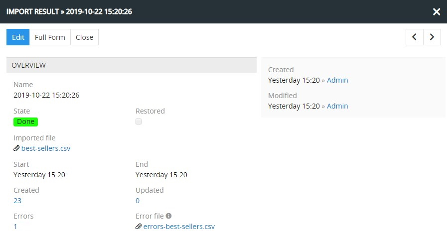
Bitte beachten Sie, dass Sie die importierte Datei von jeder [Interface-Seite](https://atropim.com/help/views-and-panels) herunterladen können, wo ihr Name anklickbar ist.

#### Fehlerdatei
Alle Daten der erforderlichen Entitätsfelder werden zu der Importdatei hinzugefügt. Falls ein Pflichtfeld in dem zum Import Feed hinzugefügten Entitätsdatensatz leer (d. h. nicht ausgefüllt) ist oder die eingegebenen Daten nicht validiert werden (z. B. stimmen die eingegebenen Daten mit dem Feldtyp nicht überein, beispielsweise Text anstelle von numerischen Werten in den Feldern von Typen `Boolean`,` Currency`, `Float`,` Unit`, sodass der eingegebene Link im System nicht existiert usw.), wird dieser Datensatz nicht importiert. Stattdessen wird er zu der Fehlerdatei hinzugefügt - einer separat generierten CSV-Datei, die nur Zeilen der Datensätze mit Fehlern enthält.

Sie können die Fehlerdatei von jeder [Interface-Seite](https://atropim.com/help/views-and-panels) herunterladen, wo ihr Name anklickbar ist, (z.B. Seite der Listenansicht von Importergebnissen, Seite der Detailansicht/ schnellen Detailansicht von Importergebnissen usw.), die Daten in den definierten Zeilen korrigieren und den Importvorgang erneut durchführen. Dabei sollen Sie die korrigierte Fehlerdatei als die zu importierende Datei nutzen. 

#### Datenwiederherstellung 
Das Modul "Import Feeds" unterstützt die Wiederherstellung für einzelne Datensätze der Importergebnisse in den Vor-Import-Zustand. Dafür wählen Sie die Option `Wiederherstellen` aus dem Menü für einzelne Datensatzaktionen für den gewünschten Datensatz mit den Importergebnissen auf der Detail-Ansichtsseite des Import Feeds:
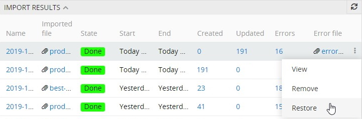

Klicken Sie in der angezeigten Bestätigungsnachricht auf den Button `Wiederherstellen`, um den Vorgang zu starten, oder auf `Abbrechen`, um den Vorgang abzubrechen. Das Pop-up des Queue Managers wird automatisch angezeigt:
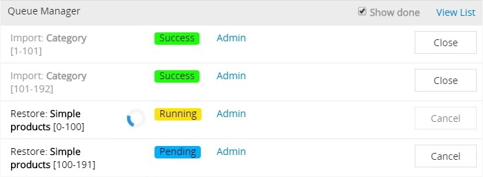

Infolgedessen verschwindet der 'wiederhergestellte' Datensatz mit den Importergebnissen aus dem Panel `IMPORT RESULTS`. Auf der Seite der Listenansicht  von Importergebnissen wird dabei die Checkbox  `Wiederhergestellt` für den Datensatz mit 'ursprünglichen' Importergebnissen aktiviert:
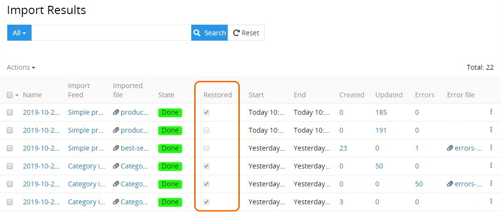

Bitte beachten Sie, dass die Datenwiederherstellung nur für das neueste Importergebnis durchgeführt wird. Die Zurücksetzung der Importergebnisse erfolgt schrittweise, d.h., dass das neueste Importergebnis nur zur vorherigen Version zurückgesetzt werden kann.

## Vorgänge und Aktionen des Moduls “Import Feeds”
Import Feed Datensätze können bei Bedarf dupliziert und entfernt werden.
Um den vorhandenen Import-Feed-Datensatz zu *duplizieren*, nutzen Sie die entsprechende Option aus dem Aktionsmenü auf der gewünschten Detail-Ansichtsseite des Import-Feed-Datensatzes:
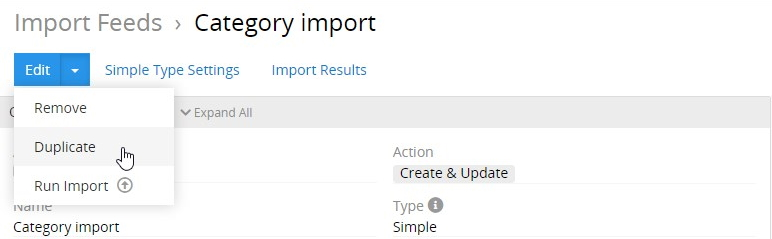

Sie werden zur Import Feed Erstellungsseite weitergeleitet und alle Werte des zuletzt ausgewählten Import Feed Datensatzes werden in die leeren Felder des neu zu erstellenden Feed Datensatzes kopiert.

Um den Import Feed Datensatz zu *entfernen*, nutzen Sie die entsprechende Option aus dem Aktionsmenü auf der gewünschten Detail-Ansichtsseite des Import Feed Datensatzes oder aus dem Menü für einzelne Datensatzaktionen auf der Ansichtsseite der Import Feeds Liste:
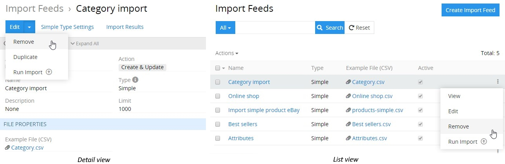

Klicken Sie in der angezeigten Bestätigungsnachricht auf den Button `Entfernen`, um den Vorgang abzuschließen.

Das Modul "Import Feeds" unterstützt auch allgemeine AtroCore-Massenaktionen, die für mehrere ausgewählte Import Feed Datensätze gelten, d.h. Datensätze mit festgelegten Checkboxen. Diese Aktionen finden Sie im entsprechenden Menü auf der Ansichtsseite der Import Feeds Liste:
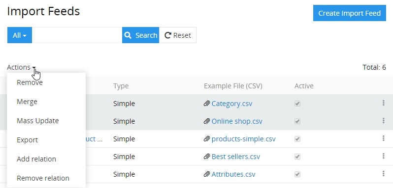

- **Löschen** – um die ausgewählten Import Feed Datensätze zu entfernen (Mehrfachlöschung).
- **Zusammenführen** – um die ausgewählten Import Feed Datensätze zusammenzuführen.
- **Massenänderung** – um mehrere ausgewählte Import Feed Datensätze gleichzeitig zu ändern. Um eine längere Liste von Feldern für die Massenänderung zu erhalten, wenden Sie sich an Ihren Administrator.
- **Exportieren** – um die gewünschten Datenfelder der ausgewählten Import Feed Datensätze im XLSX- oder CSV-Format zu exportieren.
- **Beziehung hinzufügen** – um die ausgewählten Import Feed Datensätze mit anderen Import-Ergebnisdatensätzen zu verknüpfen.
- **Beziehung entfernen** – um die Beziehungen zu entfernen, die den ausgewählten Import Feed Datensätzen hinzugefügt wurden.
## Konfiguration von Import Cron Job
Um den Import automatisch gemäß einem festgelegten Zeitplan auszuführen, können Sie die **Import Cron Jobs** konfigurieren. Um einen neuen Job-Datensatz zu erstellen, klicken Sie im Navigationsmenü auf `Import Cron Jobs`, um zur Listenansicht von Import Cron Jobs zu übergehen, und klicken Sie dann auf den Button `Import Cron Job erstellen`.

> Wenn es im Navigationsmenü keine `Import Cron Jobs` Option angezeigt wird, wenden Sie sich an Ihren Administrator.

Das allgemeine Fenster zur Erstellung wird geöffnet:

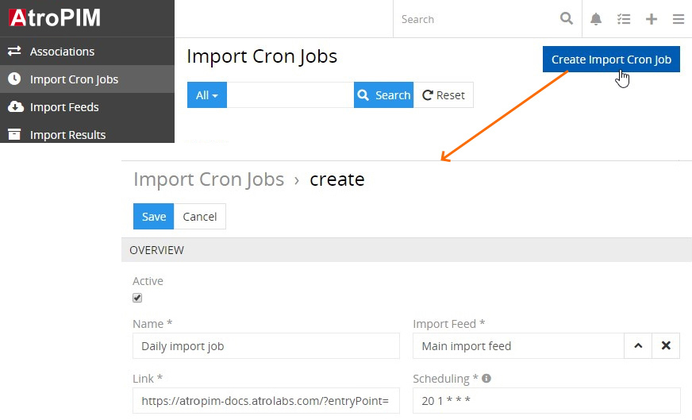

Definieren Sie hier die folgenden Parameter für den zu erstellenden Import Cron Job:

- **Aktiv** – setzen Sie die Checkbox, um den Job zu aktivieren.
- **Name** – geben Sie den Namen des Import Cron Jobs ein. 
- **Import Feed** – wählen Sie den gewünschten Import Feed aus, anhand dessen die Daten importiert werden.
- **Link** – geben Sie einen direkten Link zu der Beispieldatei (CSV) ein, aus der die Daten importiert werden.
- **Scheduling (Zeitplanung) ** – geben Sie einen gewünschten Cron Job Zeitplan ein, d.h. die Häufigkeit von Cron Jobs, und nutzen Sie dabei allgemeine Syntaxregeln.
  Wenn ein Import-Cron-Job gestartet wird, werden dessen Details im Queue Manager Popup angezeigt.

Die Ergebnisse des ausgeführten Import Cron Jobs werden im Panel `LOGS` des entsprechenden Job-Datensatzes angezeigt:

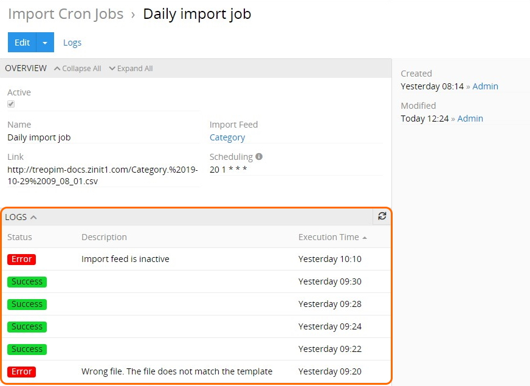

Um den Import Cron Jobs Queue und die Statusdetails anzusehen, gehen Sie zu `Administration> Schedule Jobs` und klicken Sie auf den Button `Jobs`:

## Besondere Importfälle

### Produktvarianten 

Wenn das Modul ["Product Variants"](https://atropim.com/de/shop/product-variants) in Ihrem [AtroPIM-System]((https://atropim.com/help/what-is-atropim))  installiert ist,  können Produktvarianten über Import Feeds importiert werden. Fügen Sie dazu das Entitätsfeld `Konfigurierbares Produkt` auf die [oben beschriebene Weise](#hinzufügen-der-entitätsfelder) hinzu :

Stellen Sie sicher, dass das konfigurierbare Produkt und seine Variante(-n) zu derselben [Produktfamilie](https://atropim.com/help/product-families) und demselben [Katalog](https://atropim.com/help/catalogs) gehören. Andernfalls werden diese Datensätze nicht importiert, sondern zu der [Fehlerdatei](#fehlerdatei) hinzugefügt.

Die Einrichtung anderer Felder und Attribute für den Datensatz des konfigurierbaren Produkts ist gleich wie bei dem [einfachen Produkt](#konfiguration-von-import-feeds).

Alle Attribute vom Typ `Enum` sowie [mehrsprachige Attribute](https://atropim.com/de/shop/multi-languages#mehrsprachige-attribute), die im Panel `Konfigurator` auf der Detailansichtsseite des gewünschten Import-Feed-Datensatzes hinzugefügt wurden, werden zu *variantenbildenden*, während Attribute von anderen Typen als einfache Attribute der Produktvarianten importiert werden.

Vor der Durchführung des Importvorgangs für Produktvarianten wird die Datenvalidierung aufgrund des Entitätsfelds `Konfigurierbares Produkt` vorgenommen. Abhängig von den Validierungsergebnissen kann es verschiedene Szenarien geben:

- das Feld `Konfigurierbares Produkt` ist bei einigen Datensätzen **leer**: diese Produktdatensätze werden als Datensätze vom Typ `Einfaches Produkt` importiert, d. h. Sie können gleichzeitig nicht nur die Datensätze der Produktvarianten, sondern auch Produktdatensätze von andere Typen importieren;
- das konfigurierbare Produkt, das zur Importdatei hinzugefügt ist, ist schon im System **vorhanden**: als Ergebnis des Importvorgangs werden die Datensätze der Produktvarianten aufgrund des angegebenen konfigurierbaren Produkt erstellt; 
- das  konfigurierbare Produkt, das in der Importdatei angegeben ist, **fehlt** im System:  wenn der Importvorgang durchgeführt wird, wird der Datensatz dieses konfigurierbaren Produkts aufgrund der entsprechenden Zeile der Importdatei erstellt. 

In allen anderen Fällen, wird, neben den beschriebenen Szenarien, der Import der Produktvarianten über Import Feeds genauso wie der [Import der einfachen Produkte](#import-feed-ausführung) durchgeführt. Bitte beachten Sie, dass alle Felder und Panels für die importierten Produktvarianten nach dem Abschluss des Importvorgangs automatisch entsperrt werden.

## Anpassung
Das Modul kann an Ihre Bedürfnisse angepasst werden – zusätzliche Funktionen können hinzu programmiert werden, vorhandene Funktionen können geändert werden. Bitte kontaktieren Sie uns diesbezüglich. Es gelten unsere AGB (Allgemeine Geschäftsbedingungen).

## Demo
https://demo.atropim.com/

### Installation

The Installation Guide is available [here](https://github.com/atrocore/atrocore-docs/blob/master/en/administration/installation.md).

## Lizenz

Dieses Modul wird unter der GNU GPLv3 [Lizenz](https://www.gnu.org/licenses/gpl-3.0.en.html) veröffentlicht.
