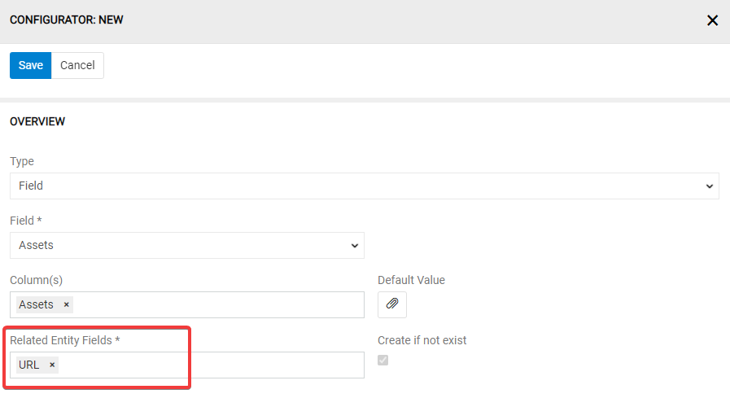
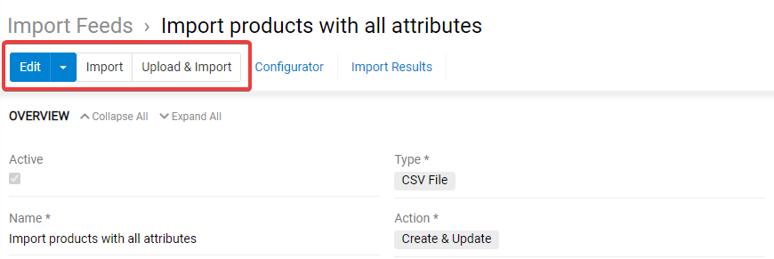
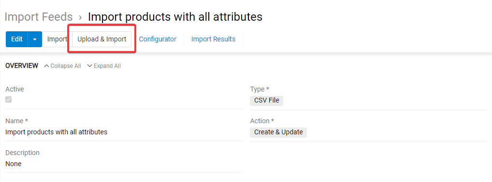
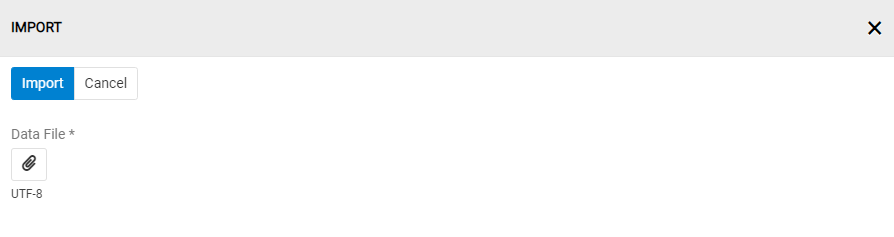
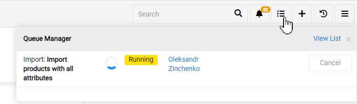
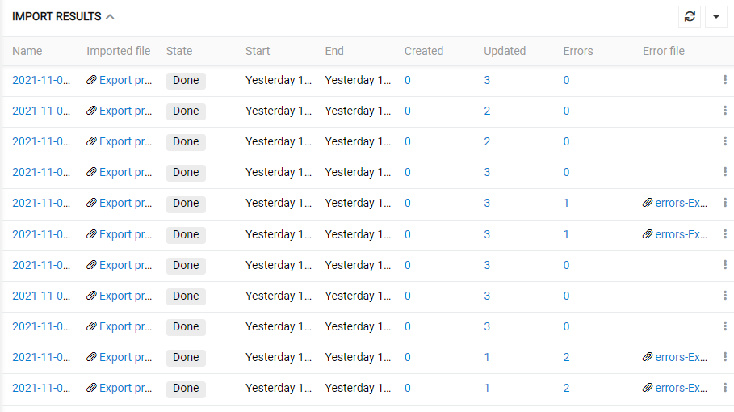
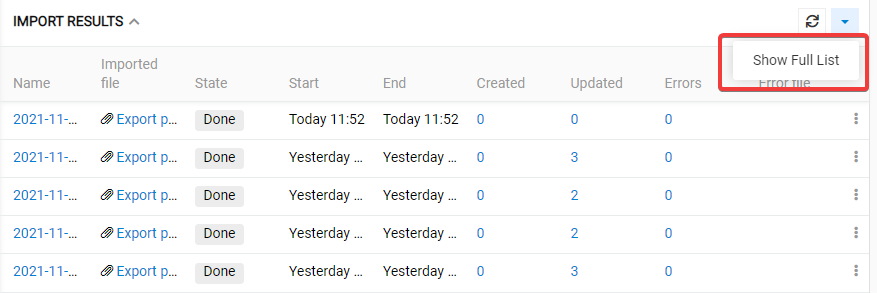
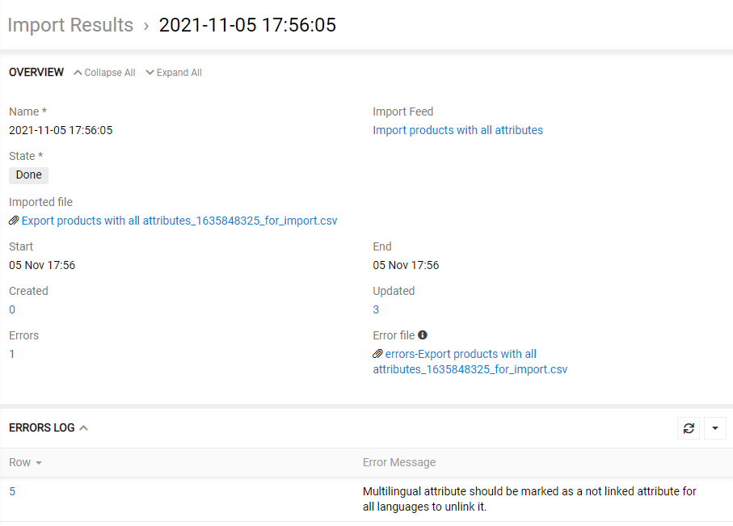
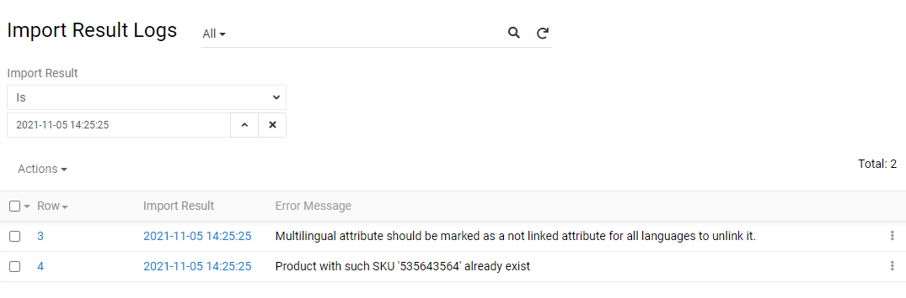
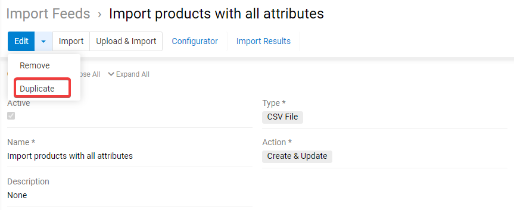

Das Modul "Feeds importieren" ermöglicht, alle Daten für beliebige Entität im AtroCore-System zu importieren, verwandte Entitäten zu verknüpfen oder neue Datensätze für sie zu erstellen, z. B. ist es möglich, die Produktdaten zusammen mit den entsprechenden Kategorien, Marken usw. zu importieren. Sie können viele Import-Feeds erstellen, konfigurieren und verwenden. Import-Feeds verwenden die AtroCore REST API, sodass alle Daten automatisch mit denselben Regeln validiert werden, als ob Sie alle Datensätze manuell erstellen würden.

Mit Hilfe des Moduls "Import Feeds" kann der Datenimport auf zwei Arten erfolgen:

- **manuell** – durch direkte Verwendung eines konfigurierten Import-Feeds
- **automatisch** – nach einem geplanten Job.

Sie können nur dann einen geplanten Job für Ihre Importaufgaben erstellen, wenn ein entsprechender Importfeedtyp in Ihrem System verfügbar ist. Solche Import-Feed-Typen ermöglichen, die Daten per URL herunterzuladen, einen REST-API-Aufruf auszuführen, eine Abfrage direkt aus der Datenbank auszuführen (dafür werden Premium-Module benötigt). Mit diesem kostenlosen Modul können Sie die Daten manuell aus CSV-Dateien importieren. Sie können auch Ihre eigenen Import-Feed-Typen programmieren lassen.

## Die folgenden Module erweitern die Funktionalität der Import-Feeds

- Import Feeds: Rollback – ermöglicht das Rollback des letzten Imports mit der vollständigen Datenwiederherstellung
- Import Feeds: Datenbanken – ermöglicht den Import von Daten aus MSSQL-, MySQL-, PostgreSQL-, Oracle-, HANA-Datenbanken
- Import Feeds: JSON und XML – ermöglicht den Import von Daten aus JSON- und XML-Dateien
- Import Feeds: URL – ermöglicht den Import von Daten per URL aus CSV-, JSON- und XML-Dateien
- Import Feeds: REST API – ermöglicht den Datenimport über die REST API
- Connector – orchestriert mehrere Import- und Export-Feeds, um einen komplexen Datenaustausch zu automatisieren

## Funktionen für den Administrator
Nach der Modulinstallation werden in Ihrem System zwei neue Entitäten erstellt - `Import Feeds` und `Import-Ergenisse`. Über `Administration > System > User Interface` können Sie diese Elemente zur Navigation Ihres Systems hinzufügen, falls es nicht automatisch geschehen ist.

### Zugangsrechte
Um die Erstellung, Bearbeitung, Nutzung und Entfernung des Import Feeds für andere Nutzer zu ermöglichen, konfigurieren Sie die entsprechenden Zugangsrechte zu den Entitäten `Import Feeds` und `Import-Ergebnisse` für die gewünschte Benutzer-/Team-/Portalbenutzerrolle auf der Seite `Administration > Rollen > 'Rollenname'`:

Bitte beachten Sie, dass für einen Nutzer mindestens die Gewährung des Leserechts auf `Import-Feeds` erforderlich ist, damit er die Import Feeds auszuführen kann.   

## Funktionen für den Nutzer
Nachdem das Modul „Import Feeds“ vom Administrator installiert und konfiguriert wurde, kann der Nutzer mit Import Feeds entsprechend seiner Rollenrechte arbeiten, die vom Administrator vordefiniert wurden.

## Erstellung von Import Feeds
Um einen neuen Import Feed zu erstellen, klicken Sie im Navigationsmenü auf `Import Feeds` und dann auf den Button `Import Feed erstellen`. 

> Wenn es im Navigationsmenü keine `Import-Feeds`-Option gibt, wenden Sie sich bitte an Ihren Administrator.

Das Standardformular für die Importfeederstellung erscheint:

Füllen Sie hier die Pflichtfelder aus und wählen den Import-Feed-Typ aus der entsprechenden Drop-down-Liste aus. Dieses Modul fügt den Import-Feed-Typ **CSV Datei** hinzu. 
Klicken Sie auf den Button `Speichern`. Der neue Datensatz wird zu der Import-Feeds-Liste hinzugefügt. Sie können es sofort auf Detailansichtsseite konfigurieren oder es später machen.

### Übersicht

Im Abschnitt Übersicht können Sie die wichtigsten Feedparameter (Name, Aktion, Aktivität usw.) definieren:

Folgende Einstellungen stehen hier zur Verfügung:

- **Aktiv** – Aktivität des Import-Feeds, Import ist nicht möglich, wenn dieses Kontrollkästchen nicht aktiviert ist
- **Name** – Importfeedname
- **Beschreibung** – Beschreibung des Import-Feeds, kann als Erinnerung für die Zukunft oder als Hinweis für andere Benutzer des angegebenen Import-Feeds verwendet werden
- **Typ** – der Import-Feed-Typ, kann später nicht geändert werden
- **Aktion** – Definieren Sie die Aktion, die beim Datenimport im System ausgeführt werden soll:
     - *Nur erstellen* – es werden nur neue Datensätze angelegt, bestehende Datensätze werden nicht aktualisiert
     - *Nur Update* – bestehende Datensätze werden aktualisiert, neue Datensätze werden nicht erstellt
     - *Create & Update* – neue Datensätze werden erstellt und die bestehenden Datensätze werden aktualisiert.

### Datei-Einstellungen

Die Parameter der Importdatei werden im Panel `FILE PROPERTIES` konfiguriert:

- **Datei** – hier können Sie die zu importierende Datei oder deren gekürzte Version (als Beispiel-Datei) hochladen, die für die Konfiguration verwendet wird. Die Datei sollte UTF-8-kodiert sein.
- **Kopfzeile** – Aktivieren Sie die Checkbox, wenn die Importdatei Spaltennamen hat oder lassen Sie diese leer, wenn die zu importierende Datei keine Kopfzeile mit Spaltennamen hat.
- **Tausender-Trennzeichen** – Definieren Sie das Symbol, das als Tausender-Trennzeichen verwendet wird. Dieser Parameter ist optional. Es werden auch die Zahlenwerte ohne Tausendertrennzeichen importiert (zB beide Werte 1234,34 und 1.234,34 werden importiert, wenn "." als Tausendertrennzeichen definiert ist).
- **Dezimalzeichen** – Wählen Sie das verwendete Dezimalzeichen aus, normalerweise sollte hier `.` oder `,` gesetzt werden.
- **Feldtrennzeichen** – Wählen Sie das bevorzugte Feldtrennzeichen, das in der CSV-Importdatei verwendet werden soll, mögliche Werte sind `,`, `;`,`\t`, `|`.
- **Textqualifizierer** – Wählen Sie das Trennzeichen der Werte innerhalb einer Zelle: Es können einfache oder doppelte Anführungszeichen ausgewählt werden.

### Feed-Einstellungen
Das nächste Panel ist das Einstellungspanel:

- **Entität** – wählen Sie die gewünschte Entität für die zu importierenden Daten aus der Dropdown-Liste aller im System verfügbaren Entitäten aus.
- **Unbenutzte Spalten** – dieses Feld ist zunächst leer. Nach dem Speichern sehen Sie hier die Liste der verfügbaren nicht zugeordneten Spalten.
- **Feldtrennzeichen für Relation** – Feldtrennzeichen, das verwendet wird, um Felder in der Relation zu trennen, Standardwert ist "|".
- **Datensatz-Trennzeichen** – ist das Trennzeichen zum Aufteilen mehrerer Werte (zB für Multienum- oder Array-Felder und -Attribute) oder mehrerer zusammengehöriger Datensätze.
- **Markierung für ein nicht verknüpftes Attribut** – diese Markierung ist nur für die Produktentität verfügbar. Dieses Symbol kennzeichnet Attribute, die nicht mit dem jeweiligen Produkt verknüpft werden sollen.
- **Leerer Wert** – Dieses Symbol wird zusätzlich zur leeren Zelle als "leerer" Wert interpretiert, zB "" und "kein" wird als "" interpretiert, wenn Sie "kein" als leeren Wert definieren.
- **Nullwert** – dieser Wert wird als "NULL"-Wert interpretiert.

Wenn Sie Produktdaten importieren, können einige Produkte bestimmte Attribute haben, andere nicht. Wenn der Wert für ein Attribut leer ist, ist nicht klar, ob dieses Attribut einen leeren Wert hat oder ob dieses Produkt dieses Attribut gar nicht hat. Aus diesem Grund sollte die **Markierung für ein nicht verlinktes Attribut** verwendet werden, um eindeutig zu kennzeichnen, welches Attribut nicht mit einem bestimmten Produkt verknüpft werden soll.

Wenn das Feld `Unbenutzte Spalten` nach dem Speichern Ihres Feeds leer ist, sollten Sie Ihr Feldtrennzeichen auf Richtigkeit überprüfen. Wenn einige Spaltennamen einfache oder doppelte Anführungszeichen enthalten, haben Sie möglicherweise den falschen Textqualifizierer eingestellt.

> Bitte beachten Sie, dass die definierten Symbole `Feldbegrenzer`, `Datensatzbegrenzer`, `Nullwert`, `Nullwert`, `Tausender-Trennzeichen`, `Dezimalzeichen`, `Textqualifizierer`  und `Markierung für ein nicht verknüpftes Attribut` unterschiedlich sein müssen.

### Konfigurator

Der Konfigurator kann verwendet werden, nachdem der Import-Feed erstellt wurde. Anfänglich ist dieses Panel leer. Hier werden Zuordnungsregeln für Ihren Datenimport angezeigt.

Um einen neuen Eintrag zu erstellen, klicken Sie auf das `+`-Symbol in der oberen rechten Ecke. Ein Popup-Fenster wird angezeigt.

- **Typ** – wählen Sie den Typ Ihrer Mapping-Regel aus, indem Sie im Feld "Typ" "Feld" von "Attribut" auswählen. Die Option "Attribut" ist nur für die Produktentität verfügbar.

- **Feld** – Wählen Sie das Feld für Ihre ausgewählte Entität aus, in das die Daten aus der/den ausgewählten Spalte(n) zu importieren sind.
- **Kennung** – setzen Sie die Checkbox, wenn der Wert in der ausgewählten Spalte als Identifier interpretiert werden soll. Sie können mehrere Spalten als Kennung auswählen.
- **Spalte(n)** – je nach Typ des ausgewählten Entitätsfeldes können Sie hier eine, zwei oder mehrere Spalten auswählen.
- **Standardwert** – Sie können den zu setzenden Standardwert angeben, wenn der Zellenwert "", "leer" oder "null" ist.

Klicken Sie auf den Button "Speichern", um die Zuordnungsregel abzuspeichern.

> Bitte beachten Sie, dass eine bestimmte Spalte in verschiedenen Regeln mehrfach verwendet werden kann.

Um die im 'Konfigurator' angezeigte Zuordnungsregel zu ändern, verwenden Sie die Option 'Bearbeiten' aus dem Aktionsmenü für einzelne Mapping-Datensätze. Hier können Sie auch die ausgewählte Regel löschen.

### Kennung (Identifier)
Für jedes Feld können Sie festlegen, ob dieses als Kennung (Identifier) gilt oder nicht. Alle Kennungen werden gemeinsam bei der Suche nach einem Datensatz in der Datenbank verwendet. Wenn Sie zB "Name" und "Marke" als Kennung beim Import in die Produktentität auswählen, versucht das System, ein solches Produkt anhand der Zellenwerte für diese beiden Felder zu finden. Wenn ein Datensatz gefunden wird, wird dieser mit den Werten aus der Importdatei aktualisiert. Wenn mehr als ein Datensatz gefunden wird, erhalten Sie eine Fehlermeldung und der Import wird nicht ausgeführt.

### Standardwert
Für jede Zuordnungsregel sollten die Spalte(n) oder der Standardwert oder beide ausgefüllt werden. Somit ist es möglich, den Standardwert festzulegen, ohne die Spalte(n) auszuwählen. In diesem Fall wird dieser Wert auf alle Datensätze angewendet. Sie können beispielsweise einen Wert für den "Katalog" festlegen. Wenn Sie Produktdaten importieren würden, werden alle Produkte automatisch dem ausgewählten Katalog zugeordnet, auch wenn Ihre Importdatei keine Spalte für "Katalog" enthält. Wird "Standardwert" leer gelassen oder kein Wert gesetzt, wird kein Standardwert als Wert übernommen.

### Attribute
Nur die Produktentität kann Attribute haben. Alle Produkte haben die gleichen Felder, können aber unterschiedliche Attribute haben (Attribut kann also als ein dynamisches Feld angesehen werden). Nur Attribute können kanalspezifische Werte haben. Um eine Zuordnungsregel für ein Attribut zu erstellen, sollen Sie beim "Typ" "Attribut" als Wert auswählen. Setzen Sie den Scope (Geltungsbereich) auf "Global", wenn der zu importierende Wert als globaler Attributwert festgelegt werden soll. Wenn dieser Wert für das Attribut als kanalspezifischer Wert gesetzt werden sollte, setzen Sie den "Scope" auf "Channel" und wählen Sie im nächsten Feld den entsprechenden Kanal aus.

### Attribute als nicht verknüpft markieren
Sie können Produktdaten für Produktfelder und Produktattribute gleichzeitig importieren. In diesem Fall sind Produktfelder und Produktattribute Spalten in Ihrer zu importierenden Datei. Wenn Sie für ein Attribut den Wert "", "leer" oder "null" verwenden, ist es unmöglich festzustellen, ob dieses Produkt dieses Attribut ohne Wert hat oder gar nicht nicht hat. Mit der `Markierung für ein nicht verlinktes Attribut` können Sie explizit die Attribute markieren, die mit einem bestimmten Produkt nicht verknüpft werden sollen. Standardmäßig wird "--" verwendet. Lassen wir uns ein Beispiel ansehen.

In diesem Beispiel werden dem Produkt "alle Attribute 4" die Attribute "\_asset", "\_varchar" und "\_varchar DE" gar nicht verknüpft.

### Boolesche Felder und Attribute
Durch den Import von booleschen Feldern oder Attributen werden "0" und "False" unabhängig von Groß- und Kleinschreibung als FALSE-Wert interpretiert. "1" und "True" werden als WAHR-Wert interpretiert. Wenn NULL-Wert für boolesches Feld oder Attribut nicht zulässig ist, werden "" und "leerer" Wert auch als FALSE-Wert interpretiert.

### Multienum-Felder und Attribute
Sie können Multienum-Werte für Felder und Attribute importieren, indem Sie ihre Werte mit Hilfe von `Datensatz-Trennzeichen` trennen. In unserem Beispiel verwenden wir dafür das Symbol ",".

.

Es können nur vordefinierte Werte akzeptiert werden, wenn Ihr Multienum-Feld oder -Attribut vordefinierte Optionen hat. Wenn einer der in der zu importierenden Datei angegebenen Multienum-Werte nicht gültig ist, wird die gesamte Zeile nicht importiert. Wenn Ihr Multienum-Feld oder -Attribut keine vordefinierten Optionen hat, wird jeder Wert akzeptiert.

### Currency- und Unit-Felder und Attribute
Felder und Attribute von Währungs- und Einheittypen haben Werte, die aus zwei Teilen bestehen – der erste ist vom Typ Float und der zweite vom Typ Enum, diese sind durch ein Leerzeichen getrennt. Beispiele für gültige Werte sind also "9 cm", "110,50 EUR", "100.000 USD", "3000 EUR" usw.

Daten für Währungs- und Einheitfelder und Attribute können in einer oder in zwei Spalten bereitgestellt werden. Wenn Sie im Feld "Spalte(n)" zwei Spalten angeben, wird in der ersten Spalte immer der Zahlenwert und in der zweiten Spalte der Währungs- oder Einheitsname erwartet.

Wenn nur eine Spalte angegeben wird, wird erwartet, dass sich der gesamte Währungs- oder Einheitswert in dieser einzelnen Spalte befindet.

Auch der Standardwert besteht aus zwei Teilen. Es ist möglich, standardmäßig nur den Währungs- oder Einheitsnamen zu speichern, ohne einen numerischen Wert zu speichern. In diesem Fall wird dieser Wert angewendet, wenn in den im Feld "Spalte(n)" eingestellten Spalten kein Währungs- oder Einheitsname gefunden wird. Wenn also zum Beispiel nur "123" angegeben wird und "EUR" als Standardwährung eingestellt ist, wird "123 EUR" als Wert abgespeichert.

### Beziehungen
Jede Entität kann Eins-zu-Viele-, Viele-zu-Eins- oder Viele-zu-Viele-Beziehungen zu anderen Entitäten haben. Das Modul Import Feeds ermöglicht den Import von Daten mit direkten Beziehungen aller Art durchzuführen. Ein Datensatz der zugehörigen Entität kann gefunden und verknüpft werden oder ein neuer Datensatz für die zugehörige Entität wird erstellt und verknüpft. Jede Relation steht zur Konfiguration als Feld zur Verfügung. Um eine Zuordnungsregel für eine Relation zu erstellen, müssen Sie den "Typ" Ihrer Zuordnungsregel auf "Feld" setzen und Ihren Relationsnamen im "Feld" Feld wählen. Lassen Sie uns "Marke" als Beziehung konfigurieren. Wir wählen also "Marke" im Feld "Feld" und "Marke" im Feld "Spalte(n)". Für eine Relation müssen wir auch die zugehörigen Entitätsfelder auswählen – wir wählen ID, Name, Name auf Deutsch, Aktiv und Code.

Wir möchten, dass die Marke erstellt wird, wenn sie in unserem System nicht gefunden wird. Deshalb setzen wir die Checkbox für die Option „Erstellen, falls nicht vorhanden“.

Die Zelle "Marke" in Ihrer CSV-Datei sollte wie folgt aussehen:

Alle Feldwerte sollten durch das "Feldtrennzeichen für Relation" getrennt werden. Standardmäßig ist Pipeline-Symbol "|" als Feldtrennzeichen für Relation eingestellt. 

Wenn "Brand1" existiert, wird es gefunden und verlinkt. Wenn "Brand2" nicht existiert, wird es erstellt und mit dem entsprechenden Produktdatensatz verknüpft.

> ID ist hier nicht erforderlich. Sie können nur "ID" verwenden, wenn alle Marken in Ihrem System bereits vorhanden sind. Sie können nur "Name", "Name auf Deutsch", "Aktiv" und "Code" auswählen, wenn die Marken in Ihrem System nicht vorhanden sind und durch den Import erstellt werden sollen. In diesem Fall wird die "ID" automatisch erstellt. Bitte beachten Sie, dass Datensätze für Marken nur dann erstellt werden, wenn "Name", "Name auf Deutsch", "Aktiv" und "Code" die einzigen Pflichtfelder für die Markenentität sind.

Das System verwendet alle zugehörigen Entitätsfelder, um nach der Beziehung zu suchen. Wird keine Relation gefunden und ist die Checkbox „Erstellen falls nicht vorhanden“ nicht gesetzt, wird die Relation ignoriert – keine Relation wird erstellt.

Die Anzahl der konfigurierten zugehörigen Entitätsfelder sollte kleiner oder gleich der Anzahl der Werte für die Beziehung in der Zelle sein. Wenn Sie beispielsweise nur "ID" und "Name" als zugehörige Entitätsfelder auswählen, werden die Daten trotzdem importiert und nur diese beiden Werte werden verwendet, um nach einer Kategorie zu suchen.

Kann der neue Datensatz für die Relation nicht angelegt werden, generiert das System einen Fehler und das System importiert nichts aus der entsprechenden Zeile.

### Mehrere Beziehungen
Mehrere Beziehungen funktionieren wie einfache Beziehungen. Der einzige Unterschied besteht darin, dass Sie mehrere Beziehungen gleichzeitig erstellen können. Mehrere Datensätze für eine zugehörige Entität sollten durch `Datensatz-Trennzeichen` getrennt werden. Zum Beispiel Produkte sind über eine Viele-zu-Viele-Beziehung mit Kategorien verknüpft, was bedeutet, dass ein Produkt verschiedenen Kategorien zugeordnet werden kann und eine Kategorien viele zugeordnete Produkte haben kann. Beispielsweise können wir Produktdaten zusammen mit Kategorien wie folgt importieren:

In diesem Beispiel wird das Produkt aus der ersten Datenzeile mit "Kategorie1" und "Kategorie2" verknüpft, hier wird das ","-Symbol als `Datensatz-Trennzeichen` verwendet.
Das zweite und das dritte Produkt werden mit "Kategorie2" bzw. "Kategorie3" verknüpft. Der Datensatz für "Kategorie2" wird nur einmal beim Anlegen/Aktualisieren des ersten Produkts erstellt (falls es im System nicht vorhanden ist) und mit dem ersten und dem zweiten Produkt verknüpft.

Wenn eine der mehreren Relationen nicht gefunden und der Datensatz nicht erstellt werden kann (vorausgesetzt, die Checkbox `Erstellen, wenn nicht vorhanden` ist gesetzt), wird die ganze Zeile nicht importiert. Wenn die Option `Erstellen, wenn nicht existiert` nicht gesetzt ist, werden alle nicht gefundenen Beziehungen ignoriert.

### Zugehörige Assets, Asset-Felder und Attribute
Bilder, Videos und andere Dateien sind Assets. Assets können für den Import genauso konfiguriert werden wie eine Relation. Wenn Sie Assets von bereitgestellten URLs importieren möchten, sollen Sie URL als zugehöriges Entitätsfeld auswählen. Wenn Sie Bilder in mehreren Spalten haben, erstellen Sie eine Zuordnungsregel für jede Spalte separat. Wenn Sie DAM Modul verwenden, werden für alle Ihre Dateien Assets direkt in DAM erstellt und mit entsprechenden Produkten verknüpft.

Die Konfiguration für die Felder und Attribute vom Typ "Asset" ist dieselbe. Ihre Dateien werden nur dann als Assets im DAM gespeichert, wenn das DAM-Modul installiert ist.

Der Import von Assets über den lokalen Serverpfad wird derzeit nicht unterstützt.

## Import-Feed ausführen

Klicken Sie auf den Button "Importieren", um die Daten aus der Datei zu importieren, die Sie während der Konfiguration Ihres Import-Feeds hochgeladen haben (Beispieldatei).

Alternativ können Sie die Daten aus einer neuen Datei importieren. Klicken Sie auf den Button "Hochladen & Importieren".

Im erscheinenden Pop-up können Sie Ihre neue CSV-Datei hochladen, die UTF-8-codiert sein sollte und dieselbe Struktur wie Ihre Beispieldatei aufweisen sollte. Klicken Sie auf die Schaltfläche "Importieren", um den Vorgang zu starten.

Der gestartete Importjob wird zum Wartenschlangenmanager hinzugefügt, in dem Sie den aktuellen Status sehen können:

Der neue Datensatz wird auch zum Panel "Import-Ergebnisse" mit dem Status "Ausstehend" hinzugefügt. Nach einem erfolgreichen Abschluss des Importauftrags wird der Status automatisch auf `Fertig` geändert.

### Importergebnisse

Informationen zu abgeschlossenen Importaufträgen werden im Bereich "Import-Ergebnisse" angezeigt. Zunächst wird hier nichts angezeigt, erst mit der Ausführung des Import-Feeds werden hier neue Einträge erscheinen.

Die Ergebnisse des Datenimports können auf zwei Arten angezeigt werden:
- im Panel "Import-Ergebnisse" des jeweiligen Import-Feeds, der die Details zu den über den aktuell geöffneten Import-Feed durchgeführten Importvorgängen anzeigt:

- auf der "Import Results Listenseite", die Details zu allen Importjobs anzeigt, die im System über Importfeeds ausgeführt wurden. Um diese Seite zu öffnen, klicken Sie in Ihrer Hauptnavigation auf `Export-Ergebnisse` oder verwenden Sie die Schaltfläche `Vollständige Liste anzeigen` in Ihrem Panel "Import-Ergebnise".

Die Details zu den Importergebnissen enthalten die folgenden Informationen:

- **Name** – der Name des Datensatzes mit den Importergebnissen, der automatisch nach dem Startdatum und -Uhrzeit des Importauftrags genannt wird. Klicken Sie auf den Namen, um die Detailansichtsseite zu öffnen.
- **Import-Feed** – der Name des für den Importauftrag verwendeten Import-Feeds. Klicken Sie auf den Namen des Import-Feeds, um die Seite des Import-Feeds zu öffnen.
- **Importierte Datei** – der Name der für den Importvorgang verwendeten Datendatei (CSV). Klicken Sie auf den Dateinamen, um diese Datei herunterzuladen.
- **State** – der aktuelle Status des Importvorgangs.
- **Start** – Startdatum und -Uhrzeit des Importjobs.
- **Ende** – Enddatum und -Uhrzeit des Importjobs.
- **Erstellt** – die Anzahl der Datensätze, die infolge der Ausführung des Importjobs erstellt wurden. Klicken Sie auf diesen Wert, um die Listenansichtsseite der entsprechenden Entitätsdatensätze zu öffnen, die nach dem entpsrechenden Import-Ergebnis gefiltert sind, d. h. mit dem Filter "Erstellt durch Import".
- **Aktualisiert** – Die Anzahl der Datensätze, die aktualisiert wurden. Klicken Sie auf diesen Wert, um die Listenansichtsseite der entsprechenden Entitätsdatensätze zu öffnen, die nach dem angegebenen Import-Ergebnis gefiltert sind, d. h. mit dem Filter "Aktualisiert durch Import".
- **Fehler** – die Anzahl der Fehler, falls vorhanden, die während des Importauftrags aufgetreten sind. Klicken Sie auf diesen Wert, um die Listenansichtsseite des Importergebnislogs zu öffnen, auf der Sie alle aufgetretenen Fehler sehen können.
- **[Fehlerdatei](#error-file)** – CSV-Datei, die nur Zeilen mit Fehlern enthält, die nicht importiert wurden. Klicken Sie auf den Fehlerdateinamen, um diese Datei herunterzuladen.

Folgende Statuswerte sind möglich:
- **Running** – für den aktuell laufenden Importjob.
- **Pending** – für den Importjob, der als nächstes zur Ausführung ansteht.
- **Erfolg** – für den erfolgreich abgeschlossenen Importjob, unabhängig davon, ob es Fehler gibt.
- **Fehlgeschlagen** – für den Importjob, der aufgrund technischer Probleme nicht ausgeführt werden konnte.

### Details über Import-Ergebnisse

Um die Details der Import-Ergebnisse anzusehen klicken Sie auf deren Namen im jeweiligen Datensatz "Import-Ergebnisse".

Die Fehlermeldungen, falls vorhanden, werden im Feld `Error Log` auf dieser Seite angezeigt.

Um eine vollständige Liste der Fehler zu sehen, klicken Sie auf `Vollständige Liste anzeigen`. Die Fehler werden gruppiert nach den aktuellen Import Job angezeigt.

### Importierte Datei

Die importierte Datei kann heruntergeladen werden, um zB zu überprüfen, was genau importiert wurde. Klicken Sie dafür auf den Dateinamen im Datensatz mit Importergebnissen.

### Fehlerdatei

Die zu importierenden Daten werden automatisch mit denselben Regeln validiert, als ob Sie diese Daten manuell hinzufügen würden. Wenn Ihre Importdatei keinen Wert für ein Pflichtfeld enthält, wird ein Fehler generiert. Andere Beispiele für ungültige Daten sind die Verwendung falscher Datentypen (z. B. wird ein "boolescher" Wert erwartet und ein "String" wird übertragen, "Integer" wird erwartet, "float" wird übertragen), fehlende Links usw.

> Bitte beachten Sie, dass Sie Daten mit leeren Pflichtfeldern importieren können, wenn Sie das Modul "Completeness" verwenden und die "Vollständigkeit" für die gewählte Entität aktiviert ist.

Der Importjob wird Zeile für Zeile ausgeführt. Dies bedeutet, dass die gesamte Zeile entweder vollständig verarbeitet wird oder vollständig nicht verarbeitet wird. Im Fehlerfall wird diese Zeile der Fehlerdatei hinzugefügt. Klicken Sie auf den Dateinamen, um diese Datei zu herunterladen. Die Fehlerdatei enthält nur Zeilen, die aufgrund eines Fehlers nicht verarbeitet wurden. Der Fehler wird immer in der letzte Spalte der Fehlerdatei beschrieben.

> Bitte beachten Sie, dass das erste Auftreten eines Fehlers ausreicht, um die Verarbeitung einer bestimmten Zeile zu stoppen. In der Fehlerdatei sehen Sie also nur einen Fehler. Es ist immer noch möglich, dass diese Zeile mehr als einen Fehler enthält.

Nachdem der Importvorgang abgeschlossen ist, können Sie die Fehlerdatei herunterladen, Ihre Daten in allen Zeilen korrigieren und diese Datei über den aktuellen Import Feed erneut importieren.

#### Datenwiederherstellung 
Das Modul "Import Feeds" unterstützt die Wiederherstellung für einzelne Datensätze der Importergebnisse in den Vor-Import-Zustand. Dafür wählen Sie die Option `Wiederherstellen` aus dem Menü für einzelne Datensatzaktionen für den gewünschten Datensatz mit den Importergebnissen auf der Detail-Ansichtsseite des Import Feeds:

Klicken Sie in der angezeigten Bestätigungsnachricht auf den Button `Wiederherstellen`, um den Vorgang zu starten, oder auf `Abbrechen`, um den Vorgang abzubrechen. Das Pop-up des Queue Managers wird automatisch angezeigt:

Infolgedessen verschwindet der 'wiederhergestellte' Datensatz mit den Importergebnissen aus dem Panel `IMPORT RESULTS`. Auf der Seite der Listenansicht  von Importergebnissen wird dabei die Checkbox  `Wiederhergestellt` für den Datensatz mit 'ursprünglichen' Importergebnissen aktiviert:

Bitte beachten Sie, dass die Datenwiederherstellung nur für das neueste Importergebnis durchgeführt wird. Die Zurücksetzung der Importergebnisse erfolgt schrittweise, d.h., dass das neueste Importergebnis nur zur vorherigen Version zurückgesetzt werden kann.

## Aktionen

Um den bestehenden Import-Feed-Datensatz zu *duplizieren*, verwenden Sie die entsprechende Option aus dem Aktionsmenü auf der Datenansichtsseite des gewünschten Import-Feeds:

Sie werden zur Erstellungsseite des Import-Feeds weitergeleitet, dabei werden alle Werte des zuletzt ausgewählten Import-Feeds kopiert. Nach dem Speichern werden auch die Mapping-Regeln aus dem Konfigurator kopiert.

Um den Import-Feed-Datensatz zu *entfernen*, verwenden Sie die entsprechende Option aus dem Aktionsmenü Ihres Import-Feeds.

## Anpassung
Das Modul kann an Ihre Bedürfnisse angepasst werden – zusätzliche Funktionen können hinzu programmiert werden, vorhandene Funktionen können geändert werden. Bitte kontaktieren Sie uns diesbezüglich. Es gelten unsere AGB (Allgemeine Geschäftsbedingungen).

## Demo
https://demo.atropim.com/

### Installation

The Installation Guide is available [here](https://github.com/atrocore/atrocore-docs/blob/master/en/administration/installation.md).

## Lizenz

Dieses Modul wird unter der GNU GPLv3 [Lizenz](https://www.gnu.org/licenses/gpl-3.0.en.html) veröffentlicht.
