The "Import Feeds" module enables the use of import feeds in a user-friendly manner. In general, *import feed* is a data import template that depends on the user needs and entity data to be imported to your system. 

With the help of the "Import Feeds" module, data import may be performed via import feeds in two ways:
- **manually** – via the preconfigured import templates, i.e. import feeds themselves;
- **automatically** – via preconfigured import cron job.

You can import via import feeds any data field available in your system, including [multilingual fields and attributes](https://atropim.com/store/multi-languages), and entity fields of the `Currency`, `Unit`, and other types. Moreover, if you have the ["Product Variants" module](https://atropim.com/store/product-variants) installed in your [PIM system](https://atropim.com), there is also the ability to import [product variants](#product-variants).

Import feeds can be further configured and customized, as well as reused at different time intervals. Import feeds can also be used to automate the data import process via [import cron jobs](#import-cron-job-configuration). 

By default, import feed of the `Simple` type comes with the "Import Feeds" module installation. However, along with the installation of other [modules](https://atropim.com/store), the list of import feed types may be extended, and these additional import feeds may be further customized according to your needs. At the same time, additional import feeds will operate using the logic of the "Import Feeds" module.

## Installation 

To install the "Import Feeds" module to your system, go to `Administration > Module Manager`, find this module in the "Store" list and click `Install`: 

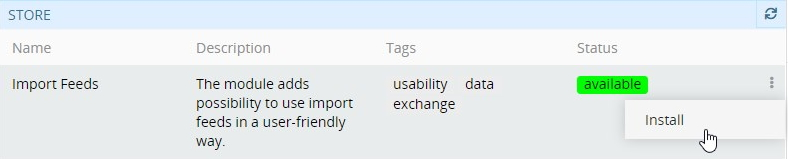

Select the desired version in the installation pop-up window that appears and click the `Install` button. The module background will turn green and it will be moved to the "Installed" section of the Module Manager. Click `Run update` to confirm its installation.

> Please, note that running the system update will lead to the logout of all users.

To update/remove the "Import Feeds" module from the system, use the corresponding options from its single record actions menu in `Administration > Module Manager`. 

## Administrator Functions

The "Import Feeds" module significantly extends the functionality of the [AtroPIM](https://atropim.com/help/what-is-atropim) system, so further description of the module is given in the context of AtroPIM.

After the module installation, a new `Import` configuration group is added to the AtroPIM administration page. Also it is possible to add `Import Cron Jobs`, `Import Feeds`, and `Import Results` as separate navigation menu items on the `Administration > User Interface` page:

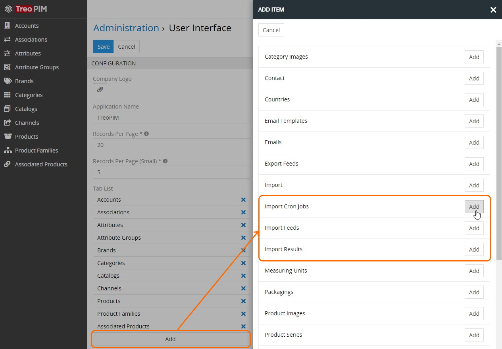

### Access Rights

To enable import feed creation, editing, usage and deletion by other users, configure the corresponding access rights to the `Import cron jobs`, `Import feeds`, `Import results` entities for the desired user / team / portal user role on the `Administration > Roles > 'Role name'` page: 

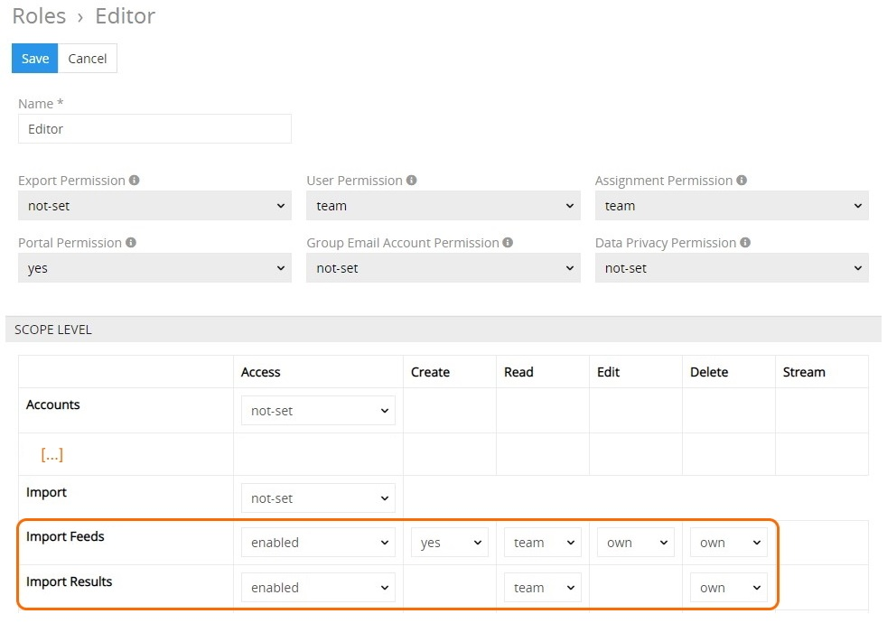

Please, note that enabling at least `Import feeds` reading right for the user is a required minimum for him to be able to run import feeds.

## User Functions 

After the "Import Feeds" module is installed and configured by the administrator, user can work with import feeds in accordance with his role rights that are predefined by the administrator.

## Import Feed Creation

To create a new import feed, click `Import Feeds` in the navigation menu and then click the `Create Import Feed` button. 

> If there is no `Import Feeds` option in the navigation menu, please, contact your administrator.

The common creation pop-up will appear:

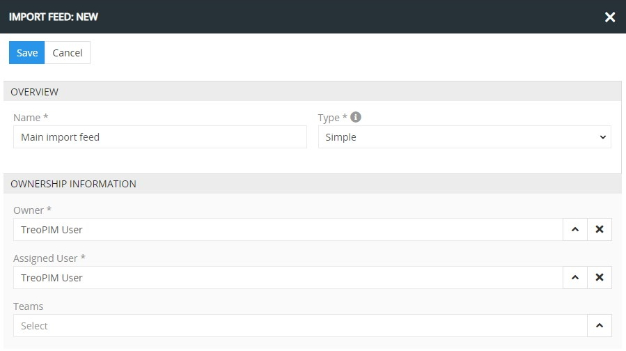

Here fill in the required fields and select the import feed type from the corresponding drop-down list. Currently the only import feed type supported is **simple** – designed for importing the data into any entity existing in your system with the ability to configure the list of fields to be imported, their order and names. 

Сlick the `Save` button to complete the operation; the new record will be added to the import feeds list. You can configure it right away on the detail view page that opens or return to it later.

## Import Feed Configuration

To configure the import feed, click the desired record in the import feeds list; the following detail view page will open:

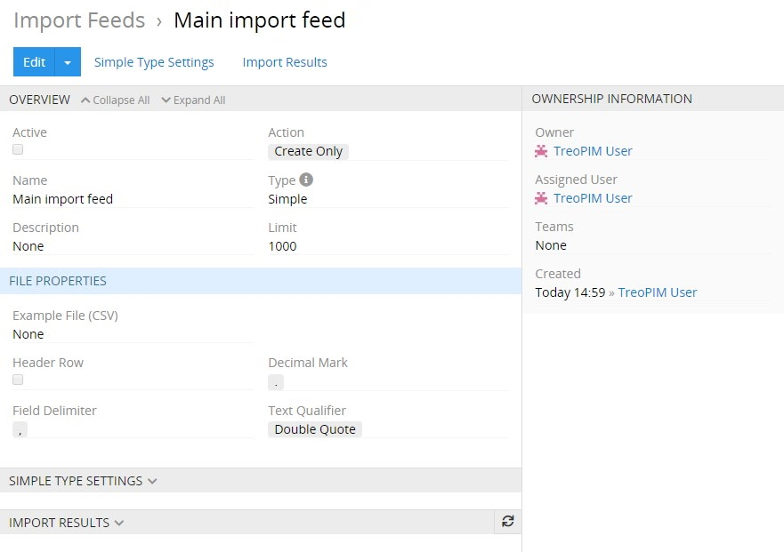

In-line editing is supported here. So prior to making any changes, you have to click the pencil icon located on the right of each editable field.

*For details on in-line editing and other features of the AtroPIM system, refer to the **Entity Records** section of the [**Views and Panels**](https://atropim.com/help/views-and-panels) article of our user guide.*

The following settings are available on the `OVERVIEW` panel:

- **Active** – select this checkbox to activate the import feed. If the import feed is not activated, the importing feature will be disabled for it.
- **Name** – modify the import feed name, if needed.
- **Description** – enter the description of the import feed usage, as a reminder for the future or as a hint for other users of the given import feed. This field is not required.
- **Action** – define the action to be performed in the system during the data import:
	- *Create Only* – new data records will be created;
    - *Update Only* – data in the already existing records will be updated;
    - *Create & Update* – new data records will be created and the existing records will be updated.
- **Type** – the import feed type defined on its creation only; it cannot be modified.
- **Limit** – maximum number of records to be imported per import job via one import feed. Depending on the limit value entered, the import template will be split into separate parts accordingly, but data import will be performed in accordance with one import feed configuration. The default records limit is 1000. 

By default, the import feed is not active and the `Create Only` action is assigned. Please, note that the choice of the action influences the content of the `SIMPLE TYPE SETTINGS` panel, described [below](#simple-type-settings).

### File Properties

The import file parameters are configured on the `FILE PROPERTIES` panel:

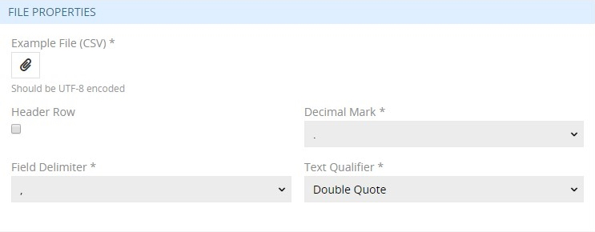

- **Example file (CSV)** – load the template in the CSV format that will be used as an example file for data import. You can use either a full or shortened import file, or file with column headers as an example file. All the data in the example file should be UTF-8 encoded. 
- **Header row** – activate the checkbox to include the column names in the import file or leave it deselected to skip column names from importing.
- **Field delimiter** – select the preferred field delimiter to be used in the import file: `,`, `;`,`\t`, `|`.
- **Decimal mark** – select the preferred decimal mark to be used in the import file: `.` or `,`.
- **Text qualifier** – select the preferred separator of the values within a cell: single or double quotes.

### Simple Type Settings

To enable editing of the parameters on the `SIMPLE TYPE SETTINGS` panel, click the `Edit` button on the detail view page of the current import feed and configure the following settings:

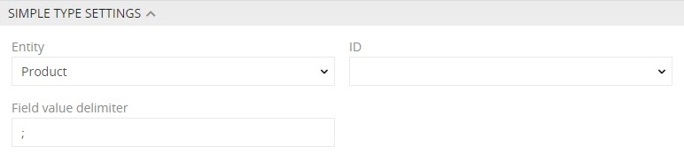

- **Entity** – from the drop-down list of entities available in the system select the desired entity type, for which this import feed will be used.
- **Field value delimiter** – enter the preferred separator of the values within a field. The default symbol is `;`.
- **ID** – select the name of the data field that will be used as the identifier for update in the given import feed. The `ID` parameter is displayed here when either the `Update only` or `Update & Create` action is defined on the [`OVERVIEW`](#overview) panel. Moreover, it is a required field for the `Update only` action. 

Please, note that the defined `Field delimiter` and `Field value delimiter` symbols must be different.

### Configurator

The configuration of the entity fields is performed on the `CONFIGURATOR` panel on either the detail or edit view page of the import feed. By default, the required fields of the entity type defined on the `SIMPLE TYPE SETTINGS` panel are displayed there, and depending on this choice, the `CONFIGURATOR` panel contains different fields. For [products](https://atropim.com/help/products), this panel looks as follows: 

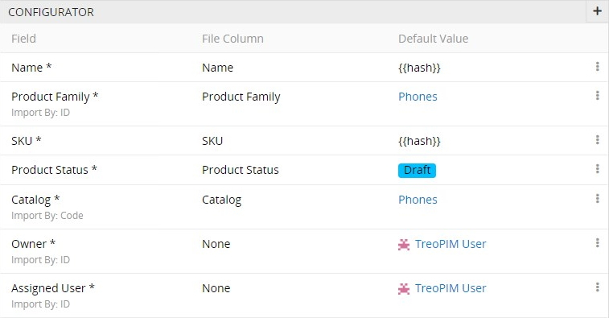

To modify the entity field displayed on the `CONFIGURATOR` panel, use the `Edit` option from the single record actions menu and make the desired changes in the editing pop-up that appears for the given entity field:

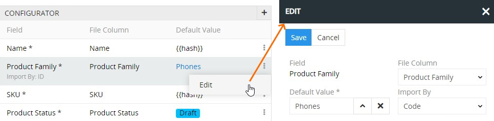 

Please, note that import by ID and code is a recommended setting for the entity field to be used in the import feed.

#### Adding Entity Fields

It is possible to add more *entity fields* for import. For this select the `Add entity field` option from the adding drop-down menu; the following creation pop-up will appear:

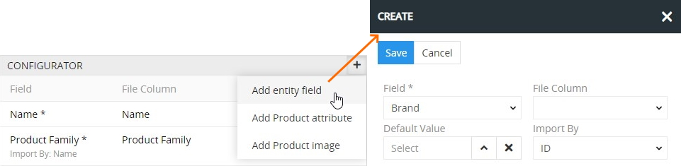

Here select the field from the drop-down list of all fields available in the system for the given entity, define its default value and/or select its file column. Also define whether data import should be made by ID, name or code (for those fields, where this option is available). 

Please, note that either the `File column` or `Default value` field must be filled in. Otherwise, the current entity field cannot be created:

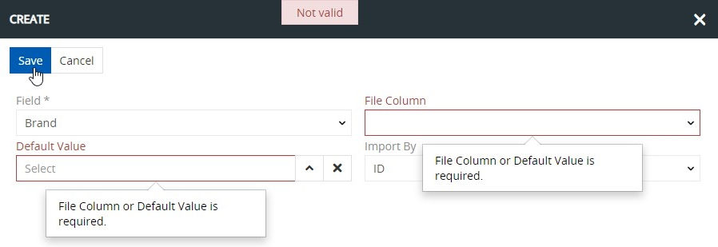

Entity fields of the `Currency`, and `Unit` types, as well as [multilingual fields](https://atropim.com/store/multi-languages) can also be added to import feeds:

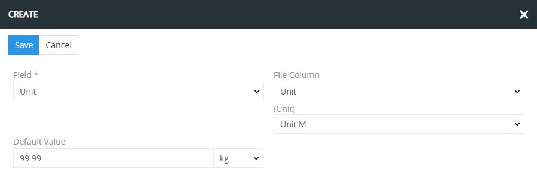

For the `Product categories` field there is also the ability to choose its scope level:

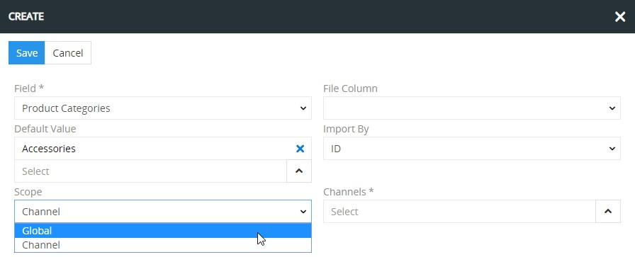

If the `Channel` scope level is defined, also select the required channel to be used for product categories in the corresponding field. 

Please, note that entity fields can be added to the import feed record only once, except for the `Product categories` field, which may be added as many times as needed, but with different scope levels and different channels:

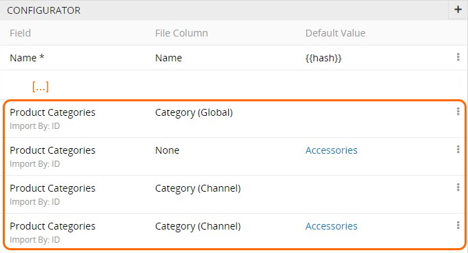

Once the entity field is added to the configurator, it is added to the `ID` drop-down list on the [`SIMPLE TYPE SETTINGS`](#simple-type-settings) panel. 

#### Adding Product Attributes

The "Import Feeds" module also allows you to import *[product attribute](https://atropim.com/help/products) values*, including [multilingual attributes](https://atropim.com/store/multi-languages#multilingual-attributes). They can be added to the import feed on the `CONFIGURATOR` panel via the `Add product attribute` option from the adding drop-down menu:

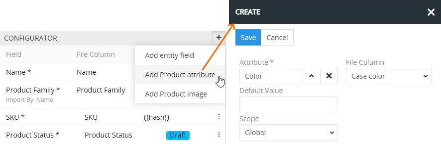

Please, note that this feature is available only when the [AtroPIM module](https://atropim.com/help/what-is-atropim) is installed together with the "Import Feeds" module.

In the creation pop-up that appears, select the attribute from the list of the existing attributes, define its default value and/or select its file column. Also define the attribute scope level – `Global` or `Channel`. 

Make sure that the `File column` or `Default value` field is filled in; otherwise, the given product attribute will not be created.

Please, note that the same product attribute can be added to the import feed record more than once, but with different scope levels (`Global` or `Channel`) and different channels.

#### Adding Product Images

*Product images* can also be added for import via the "Import Feeds" module. For this select the `Add product image` option from the adding drop-down menu on the `CONFIGURATOR` panel:

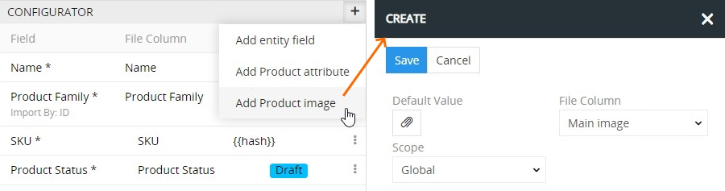

Please, note that this feature is available only when the AtroPIM module is installed together with the "Import Feeds" module.

In the creation pop-up that appears, select the file column for the image import and/or attach the locally stored image file to be used as the default value for import. Also define the image scope level – `Global` or `Channel`. 

Make sure that at least the `File column` field is filled in; otherwise, the given product image will not be created.

Having added the [entity field](#adding-entity-fields), [product attribute](#adding-product-attributes) and [product image](#adding-product-images) records to the import feed, you can edit or remove them via the corresponding options of the single record actions menu:

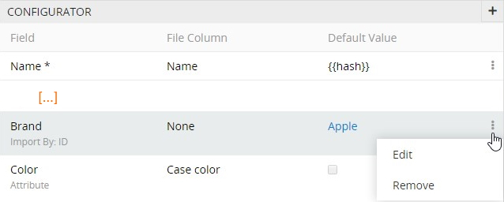

If you have any further questions about the import feed configuration, please, feel free to [contact us](https://atropim.com/contact) any time.

## Running Import Feed

To start importing the data via the active import feed, select the `Run import` option from the actions menu on its detail view page or from the single record actions menu on the "Import Feeds" list view page:

In the pop-up that appears, attach the CSV file with data to be imported and click the `Run import` button to start the process:

Please, note that the data file must match the example file, defined for the given import feed. Otherwise, the error message will appear:

 

When import is started, its details and current status are displayed in the Queue Manager pop-up that appears automatically:

Please, note that if the number of records in the data file exceeds the [limit](#import-feed-configuration) value defined on the `OVERVIEW` panel of the given import feed, the import job will be split into the corresponding parts in accordance with the limit value.

### Import Results

Information about completed import jobs is displayed on the `IMPORT RESULTS` panel, which is empty on the import feed [creation](#import-feed-creation) step, but gets filled in after the data import is performed via the given import feed.

Results of the data import operations can be viewed in two ways:
- on the **`IMPORT RESULTS` panel** of the import feed – the details on the import operations performed via the currently open import feed:

- on the **import results list view page** – the details on all import operations performed in the system via import feeds:

The import results details contain the following information:

- **Name** – the import result record name, which is generated automatically based on the date and time of the import operation start. Click the import result record name to open its detail view page.
- **Import feed** – the name of the import feed used for the import operation. Click the import feed record name to open its detail view page.
- **Imported file** – the name of the data file (CSV) used for the import operation. Click the imported file name to download it. 
- **Status** – the current status of the import operation.
- **Restored** – the indication of whether the given import result record has been restored (the checkbox is selected) or not.
- **Start** – the date and time of the import operation start.
- **End** – the date and time of the import operation end.
- **Created** – the number of records created as a result of the performed import operation. Click this value for the desired import result to open the list view page of the corresponding entity records filtered by the given import result, i.e. with the `Created by import` filter applied.
- **Updated** – the number of records updated as a result of the performed import operation. Click this value for the desired import result to open the list view page of the corresponding entity records filtered by the given import result, i.e. with the `Updated by import` filter applied.
- **Errors** – the number of errors, if any, that occurred during the import operation. Click this value for the desired import result to open the list view page of the import result log records.
- **[Error file](#error-file)** – the name of the CSV file that contains only rows with errors. The error file name is generated automatically based on the imported file name. Click the error file name to download it.

The following status options are available:
- **Running** – for the currently running import job.
- **Pending** – for the import job, which is next in line for execution.
- **Success** – for the successfully finished import job (no matter if it contains any errors in it).
- **Failed** – for the import job that could not be performed due to some technical issues.

#### Details

To view the import result record details, click its name on the `IMPORT RESULTS` panel within the desired import feed detail view page or in the import results list; the corresponding import result record detail view page opens:

The error messages, if any, are displayed on the `ERRORS LOG` panel on this page: 

To see a full list of error records, use the `Show Full List` action menu command – the import result logs list appears with records filtered by the given import result:

Alternatively, view the import result record details in the pop-up that appears when you use the `View` option from the single record actions menu for the desired record on the import results list view page or on the `IMPORT RESULTS` panel of the currently open import feed:

Please, note that you can download the imported file from any [interface page](https://atropim.com/help/views-and-panels), where its name is clickable.

#### Error File

All data of the required entity fields are added to the import file. In case any required field is empty (i.e. not filled in) in the entity record added to the import feed, or the entered data are not validated (e.g. the data entered do not match the field type (e.g. text instead of numerical values in the `Boolean`, `Currency`, `Float`, `Unit` field types), the link entered does not exist in the system, etc.), this record is not imported. Instead, it is added to the error file – a separately generated CSV file containing only rows of records with errors.

You can download the error file from any [interface page](https://atropim.com/help/views-and-panels) where its name is clickable (e.g. import results list view, import result record detail/quick detail view, etc.), correct the data in the defined rows, and run the import operation again using the corrected error file as the data file.

#### Data Restoration

The "Import Feeds" module supports data restoration for separate import results record to the pre-import state. To do this, select the `Restore` option from the single record actions menu for the desired import result record on the import feed detail view page:

Click the `Restore` button in the confirmation message that appears to start the process or `Cancel` to abort the process. The Queue Manager pop-up will automatically appear:

As a consequence, the 'reverted' import result record will disappear from the `IMPORT RESULTS` panel, and on the import results list view page the `Restored` checkbox will become selected for the 'initial' import result record:

Please, note that data restoration is performed only for the latest import result. 

## Import Feed Operations and Actions

Import feed records can be duplicated and removed whenever needed.

To *duplicate* the existing import feed record, use the corresponding option from the actions menu on the desired import feed record detail view page:

You will be redirected to the import feed creation page and get all the values of the last chosen import feed record copied in the empty fields of the new feed record to be created. 

In order to *remove* the import feed record, use the corresponding option from the actions menu on the desired import feed record detail view page or from the single record actions menu on the import feeds list view page:

To complete the operation, click the `Remove` button in the confirmation message that appears.

The "Import Feeds" module also supports common AtroCore *mass actions* that can be applied to several selected import feed records, i.e. records with set checkboxes. These actions can be found in the corresponding menu on the import feeds list view page:

- **Remove** – to remove the selected import feed records (multiple deletion).
- **Merge** – to merge the selected import feed records.
- **Mass update** – to update several selected import feed records at once. To have a longer list of fields available for mass updating, please, contact your administrator.
- **Export** – to export the desired data fields of the selected import feed records in the XLSX or CSV format.
- **Add relation** – to relate the selected import feed records with other import result record(s).
- **Remove relation** – to remove the relations that have been added to the selected import feed records.

## Import Cron Job Configuration

In order to run import automatically according to the schedule, you can configure **import cron jobs**. To create a new job record, click the `Import Cron Jobs` in the navigation menu to get to the import cron jobs list view, and then click the `Create Import Cron Job` button. 

> If there is no `Import Cron Jobs` option in the navigation menu, please, contact your administrator.

The common creation window will open:

Here define the following parameters for the import cron job being created:

- **Active** – select the checkbox to activate the job.
- **Name** – enter the import cron job name. 
- **Import feed** – select the desired import feed, based on which the data will be imported.
- **Link** – enter a direct link to the example file (CSV) from which the data will be imported.
- **Scheduling** – enter a desired cron job schedule, i.e. frequency of job runs, using common syntax rules. 

When an import cron job is started, its details are shown in the Queue Manager pop-up.

The results of the run import cron job are displayed on the	`LOGS` panel of the corresponding job record:

To view the import cron jobs queue and status details, please, go to `Administration > Schedule Jobs` and click the `Jobs` button:

## Special Import Cases

### Product Variants

If there is the ["Product Variants" module](https://atropim.com/store/product-variants) installed in your [AtroPIM system](https://atropim.com/help/what-is-atropim), product variants can be imported via import feeds. For this, add the `Configurable Product` entity field in the same way as described [above](#adding-entity-fields):

Make sure the configurable product and its variant(s) belong to the same [product family](https://atropim.com/help/product-families) and [catalog](https://atropim.com/help/catalogs). Otherwise, these records will not be imported, but added to the [error file](#error-file).

The setup of other fields and attributes for the configurable product record is the same as for the [simple product](#import-feed-configuration).

All attributes of the `Enum` type as well as [multilingual attributes](https://atropim.com/store/multi-languages#multilingual-attributes), added on the `CONFIGURATOR` panel within the desired import feed record detail view page, become *variant-forming*, whereas attributes of other types are imported as common attributes of the product variants.

Prior to running the import process for product variants, data validation is performed on the basis of the `Configurable Product` entity field, and depending on the validation results, there may be several scenarios:

- the `Configurable Product` field is **empty** for some records: these product records are imported as records of the `Simple Product` type, i.e. you can import at the same time not only product variant records, but also product records of other types;

- a configurable product, which is added to the import file, already **exists** in the system: as a result of the import operation, product variant records are created on the basis of the given configurable product;

- a configurable product defined in the import file **is missing** in the system: [running](#running-import-feed) the import operation results in the creation of this configurable product record on the basis of the corresponding import file row.

In all other cases, besides the described scenarios, the product variants import via import feeds is performed in the same way as the [simple product import](#running-import-feed). Also note that once the import process is completed, all fields and panels are automatically unlocked for the imported product variants.

## Customization
The module can be adapted to your needs, additional functions can be programmed, existing functions can be changed. Please contact us regarding this. Our GTC (General Terms and Conditions) apply.

## Demo
https://demo.atropim.com/
